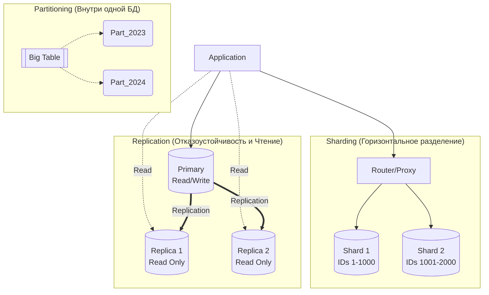

# Репликация, Шардирование, Партиционирование

## 📖 DevOps-история: Боль и решение
**Боль:** Монолитная база данных PostgreSQL начала упираться в 100% CPU и IOPS. Приложения тормозили при построении тяжелых аналитических отчетов, мешая обычным пользователям. А позже таблица с логами транзакций выросла до сотен гигабайт, и запросы к ней стали длиться вечность.
**Решение:** 
1. **Репликация:** Развернули Read-реплику для аналитиков, разгрузив Primary (Master).
2. **Партиционирование:** Разбили огромную таблицу с логами по месяцам (партиции). 
3. **Шардирование:** Когда данные перестали влезать в один диск, разбили базу на несколько независимых серверов (шардов) по ID клиентов.

## 🗺️ Mermaid-схема (Архитектура масштабирования)


## 🛠️ Примеры (Настройка)

### Партиционирование (PostgreSQL)
Создание партиционированной таблицы по времени:
```sql
CREATE TABLE access_log (
    id serial,
    log_time timestamp NOT NULL,
    message text
) PARTITION BY RANGE (log_time);

CREATE TABLE access_log_2024_01 PARTITION OF access_log
    FOR VALUES FROM ('2024-01-01') TO ('2024-02-01');
```

### Репликация (PostgreSQL)
Пример настройки standby сервера (`recovery.conf` / `postgresql.conf`):
```bash
primary_conninfo = 'host=primary_db port=5432 user=repuser password=secret'
standby_mode = 'on'
```

### Шардирование (Концепт в коде)
```python
# Простой роутинг шардов на уровне приложения
def get_db_connection(user_id):
    if user_id % 2 == 0:
        return connect("db-shard-0.internal")
    else:
        return connect("db-shard-1.internal")
```

## 🚀 Day 2 operations & Антипаттерны

### Советы (Day 2)
- **Мониторинг Replication Lag:** Если реплика отстает на минуты, пользователи могут видеть устаревшие данные. Настройте алерты на `pg_stat_replication`.
- **Автоматизация партиционирования:** Используйте инструменты вроде `pg_partman` для автоматического создания будущих партиций и удаления старых (Data Retention).
- **Пул коннектов для реплик:** Используйте PgBouncer или HAProxy для балансировки read-запросов между несколькими репликами.

### ❌ Антипаттерны
- **Шардирование "на всякий случай":** Внедрение шардирования (например, Vitess или Citus) до того, как вы уперлись в вертикальное масштабирование. Это кратно усложняет инфраструктуру.
- **Неправильный Shard Key:** Выбор ключа шардирования, который приводит к "горячим" шардам (например, шардирование по дате — все новые записи летят в один шард).
- **Тяжелые JOIN'ы при шардировании:** Попытка делать аналитические запросы с JOIN'ами между таблицами, лежащими на разных физических серверах (шардах).
