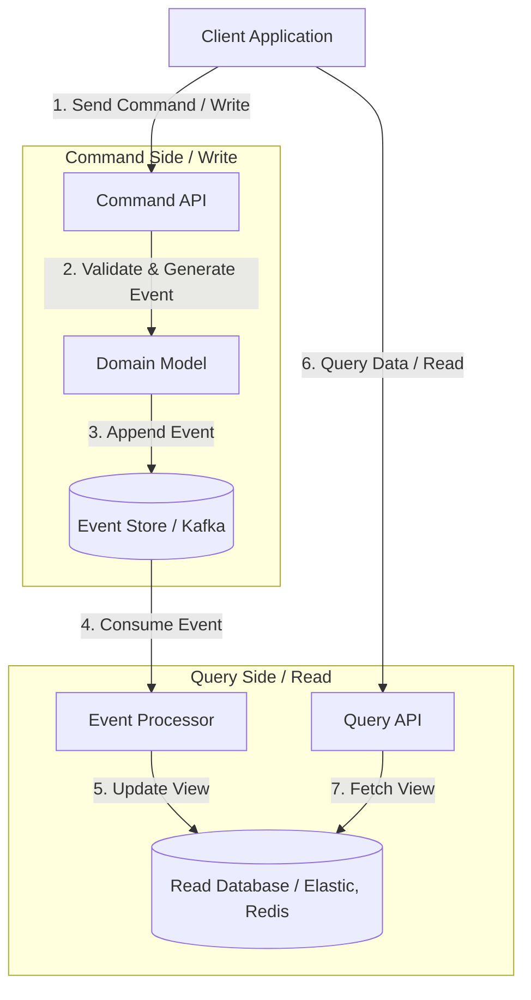

# Event-Driven Architecture (Event Sourcing, CQRS)

## DevOps-история: Боль и Решение
**Боль:** Монолитное приложение или синхронные микросервисы (по REST/gRPC) начали страдать от каскадных сбоев. Обновление одной базы данных блокировало другие процессы, а жесткая связанность сервисов делала развертывание и масштабирование мучительными. Потеря данных при сбоях стала нормой.
**Решение:** Переход на Event-Driven Architecture (EDA). Использование паттернов Event Sourcing (хранение всех изменений в виде последовательности событий) и CQRS (разделение операций чтения и записи) позволило асинхронно обрабатывать данные. Теперь сервисы слабо связаны, масштабируются независимо, а история событий позволяет легко восстанавливать состояние системы.

## Архитектура (CQRS + Event Sourcing)



## Примеры реализации

### 1. Bash: Простая симуляция Event Sourcing через Kafka (cli)
```bash
# Продюсер (Command side): Запись события "OrderCreated"
echo '{"orderId": 123, "status": "CREATED", "amount": 100}' | \
  kafka-console-producer.sh --broker-list localhost:9092 --topic orders-events

# Консьюмер (Query side): Чтение событий для обновления Read DB
kafka-console-consumer.sh --bootstrap-server localhost:9092 \
  --topic orders-events --from-beginning \
  --property print.key=true
```

### 2. Псевдокод (Python): Обработка событий (CQRS Projection)
```python
def process_event(event):
    if event.type == "OrderCreated":
        # Обновляем денормализованную базу для быстрого чтения
        read_db.execute(
            "INSERT INTO orders_view (id, status, total) VALUES (?, ?, ?)",
            (event.orderId, event.status, event.amount)
        )
    elif event.type == "OrderShipped":
        read_db.execute(
            "UPDATE orders_view SET status = ? WHERE id = ?",
            ("SHIPPED", event.orderId)
        )
```

## Day 2 Operations

- **Идемпотентность:** Гарантируйте, что обработчики событий идемпотентны. В EDA события могут доставляться "at least once", что означает риск повторной обработки.
- **Мониторинг Лага (Consumer Lag):** Критически важно отслеживать отставание Query-side от Event Store. Большой лаг означает, что пользователи видят устаревшие данные.
- **Снапшоты (Snapshots):** При Event Sourcing восстановление состояния из миллионов событий занимает много времени. Настройте регулярное создание снапшотов состояния агрегатов.
- **DLQ (Dead Letter Queue):** Всегда настраивайте DLQ для событий, которые невозможно обработать, чтобы не блокировать всю очередь (poison pill).

## Антипаттерны
- **Синхронное ожидание ответа:** Пытаться сделать EDA синхронным (например, ждать ответа от Query-side сразу после отправки команды). Это убивает весь смысл асинхронности.
- **Event-Driven Spaghetti:** Отсутствие четкой схемы событий (Schema Registry) и хаотичная публикация событий. Приводит к тому, что никто не понимает потоки данных.
- **Толстые события (Fat Events):** Передача всего состояния объекта в каждом событии вместо передачи только дельты (изменений). Засоряет канал и усложняет упорядочивание.
