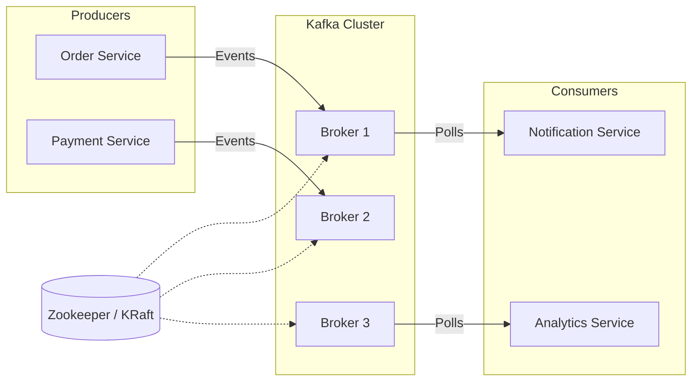

# Основы Apache Kafka

## 📖 DevOps-история: Боль и Решение

**Боль:** В компании был монолит, который общался с другими системами через REST API (синхронно). При пиковых нагрузках (например, "Черная Пятница") микросервисы начинали падать по цепочке (cascading failures), потому что один сервис не справлялся и тянул за собой остальные. Базы данных задыхались от количества одновременных подключений. Данные терялись при перезапусках.

**Решение:** Внедрение Apache Kafka как распределенного журнала событий (event streaming platform). Микросервисы больше не ждут друг друга: одни (Producers) просто "кидают" события в Kafka, другие (Consumers) забирают их в своем темпе. Kafka буферизирует нагрузку, гарантирует сохранность данных и позволяет легко масштабироваться.

## 🏗 Архитектура



## 💻 Примеры

### Запуск локального кластера через Docker Compose (с KRaft, без Zookeeper)
```yaml
version: '3'
services:
  kafka:
    image: confluentinc/cp-kafka:7.5.0
    container_name: kafka
    environment:
      KAFKA_NODE_ID: 1
      KAFKA_LISTENER_SECURITY_PROTOCOL_MAP: CONTROLLER:PLAINTEXT,PLAINTEXT:PLAINTEXT
      KAFKA_LISTENERS: PLAINTEXT://0.0.0.0:9092,CONTROLLER://0.0.0.0:9093
      KAFKA_ADVERTISED_LISTENERS: PLAINTEXT://localhost:9092
      KAFKA_CONTROLLER_LISTENER_NAMES: 'CONTROLLER'
      KAFKA_CONTROLLER_QUORUM_VOTERS: '1@kafka:9093'
      KAFKA_PROCESS_ROLES: 'broker,controller'
      CLUSTER_ID: 'MkU3OEVBNTcwNTJENDM2Qk'
    ports:
      - "9092:9092"
```

### Базовые команды (Bash)
```bash
# Создать топик
kafka-topics.sh --create --topic user-events --bootstrap-server localhost:9092 --partitions 3 --replication-factor 1

# Отправить сообщение
echo "Hello Kafka" | kafka-console-producer.sh --topic user-events --bootstrap-server localhost:9092

# Прочитать сообщение
kafka-console-consumer.sh --topic user-events --from-beginning --bootstrap-server localhost:9092
```

## 🛠 Day 2 Operations (Советы по эксплуатации)

*   **Мониторинг JMX метрик:** Обязательно собирайте метрики через JMX Exporter в Prometheus. Ключевые метрики: `UnderReplicatedPartitions` (всегда должно быть 0!), `OfflinePartitionsCount`, `NetworkProcessorAvgIdlePercent`.
*   **Управление дисками:** Kafka хранит данные на диске (log segments). Настройте алерты на заполнение диска (например, при 80%). Используйте XFS или ext4, разнесите логи ОС и логи Kafka на разные диски.
*   **Retention Policy:** Настраивайте `log.retention.hours` или `log.retention.bytes` в зависимости от бизнес-логики и объема дисков.
*   **OS Tuning:** Увеличьте лимиты файловых дескрипторов (`ulimit -n 100000`), отключите swap (`vm.swappiness=1`), настройте dirty ratios.

## ⛔ Антипаттерны

*   **Использование Kafka как базы данных:** Не храните события вечно без необходимости (если это не event sourcing с compacted topics). Kafka — это стриминговая платформа.
*   **Огромные сообщения:** По умолчанию Kafka рассчитана на сообщения до 1MB. Отправка файлов/видео через Kafka (blob) — плохая идея. Лучше положите файл в S3, а в Kafka отправьте ссылку на него (Claim Check pattern).
*   **Слишком много партиций:** Каждая партиция — это файловые дескрипторы и память. Сотни тысяч партиций в кластере приведут к большим задержкам при перевыборах лидера.
