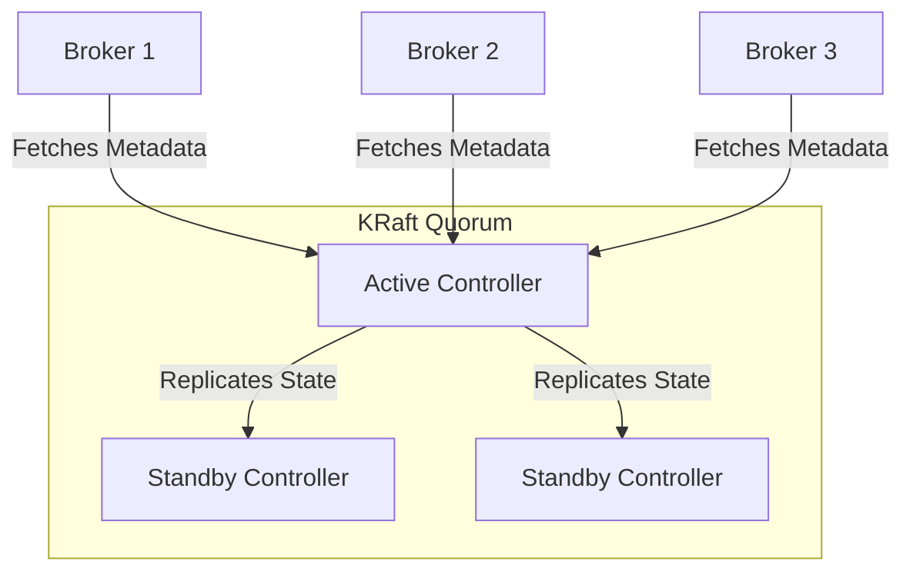

# Apache Kafka: KRaft, Security, Monitoring

## DevOps-история: Боль и Решение
**Боль:** Исторически Kafka зависела от Apache ZooKeeper для хранения метаданных, что приводило к проблемам масштабируемости, сложности настройки ("две системы вместо одной") и увеличению задержек при выборах контроллера в больших кластерах. Отсутствие прозрачности в безопасности и мониторинге только добавляло головной боли при инцидентах.
**Решение:** Внедрение Kafka Raft (KRaft) режима позволило отказаться от ZooKeeper. Теперь брокеры сами управляют метаданными, что значительно ускоряет работу кластера, упрощает развертывание и обеспечивает лучшую масштабируемость. Встроенные механизмы Security (SASL/SCRAM, TLS) и подробный JMX-мониторинг завершают картину enterprise-grade решения.

## Архитектура KRaft



## Примеры конфигурации

### 1. docker-compose.yml для KRaft (без ZooKeeper)
```yaml
version: '3.8'
services:
  kafka:
    image: confluentinc/cp-kafka:7.4.0
    ports:
      - "9092:9092"
    environment:
      KAFKA_NODE_ID: 1
      KAFKA_PROCESS_ROLES: 'broker,controller'
      KAFKA_CONTROLLER_QUORUM_VOTERS: '1@kafka:29093'
      KAFKA_LISTENERS: 'PLAINTEXT://kafka:29092,CONTROLLER://kafka:29093,EXTERNAL://0.0.0.0:9092'
      KAFKA_ADVERTISED_LISTENERS: 'PLAINTEXT://kafka:29092,EXTERNAL://localhost:9092'
      KAFKA_LISTENER_SECURITY_PROTOCOL_MAP: 'CONTROLLER:PLAINTEXT,PLAINTEXT:PLAINTEXT,EXTERNAL:PLAINTEXT'
      KAFKA_CONTROLLER_LISTENER_NAMES: 'CONTROLLER'
      CLUSTER_ID: 'MkU3OEVBNTcwNTJENDM2Qk'
```

### 2. Настройка Security (TLS + SASL/SCRAM) в server.properties
```properties
# Включение TLS
listeners=SASL_SSL://:9093
security.inter.broker.protocol=SASL_SSL
ssl.keystore.location=/var/private/ssl/kafka.server.keystore.jks
ssl.keystore.password=secret
ssl.truststore.location=/var/private/ssl/kafka.server.truststore.jks
ssl.truststore.password=secret
ssl.client.auth=required

# SASL/SCRAM
sasl.enabled.mechanisms=SCRAM-SHA-256,SCRAM-SHA-512
```

## Day 2 Operations

- **Мониторинг JMX:** Всегда настраивайте экспорт метрик (например, через JMX Exporter для Prometheus). Ключевые метрики: `UnderReplicatedPartitions`, `OfflinePartitionsCount`, `ActiveControllerCount`, `NetworkProcessorAvgIdlePercent`.
- **Ротация ключей:** Планируйте механизмы ротации TLS сертификатов и паролей SASL без даунтайма (Rolling Restart).
- **Квоты (Quotas):** Внедряйте квоты на producers/consumers (`produce.rate`, `fetch.rate`), чтобы один "плохой" клиент не положил весь кластер.
- **Бекап метаданных:** Даже в KRaft необходимо следить за местом на диске, куда пишутся логи метаданных.

## Антипаттерны
- **Отсутствие шифрования в production:** Использование PLAINTEXT вне доверенной сети (VPC) приводит к риску перехвата сообщений.
- **Огромное количество партиций на одном брокере:** Приводит к чрезмерной нагрузке на CPU и диск. Даже с KRaft лучше придерживаться правила < 4000 партиций на брокер.
- **Слепая вера в "автоматическое" восстановление:** Не настраивать алерты на падение узла кворума KRaft. Если большинство контроллеров упадет, кластер перейдет в read-only режим.
