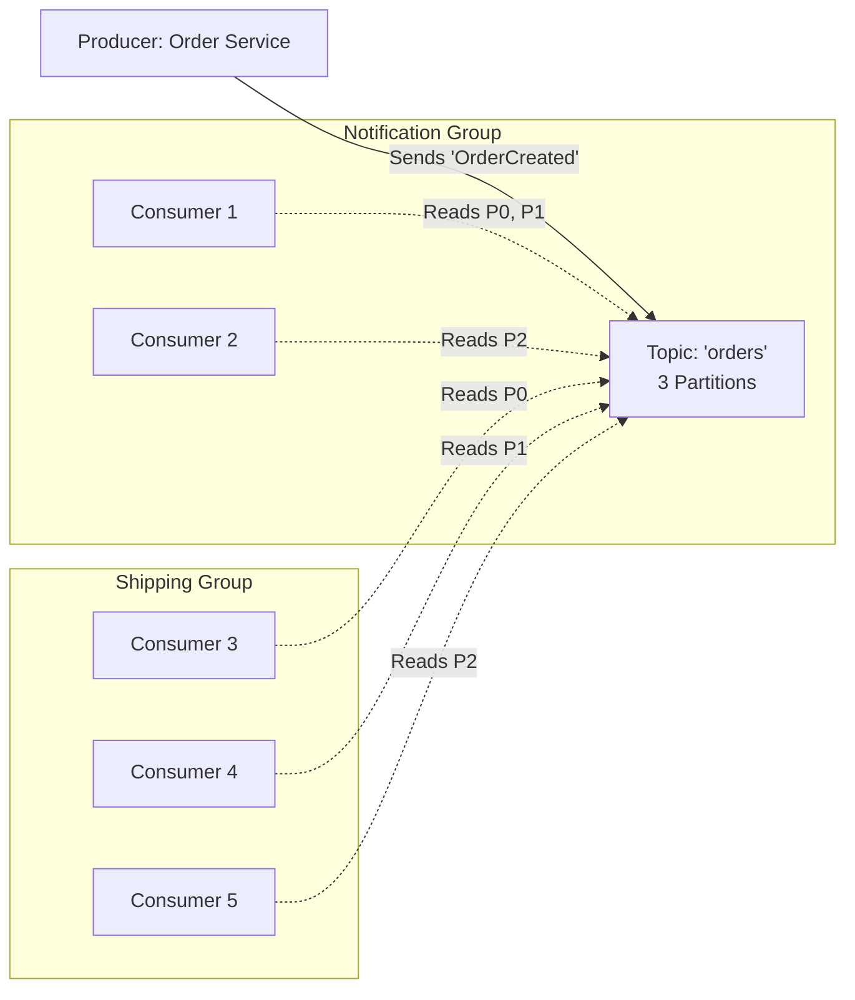

# Producers, Consumers, Consumer Groups

## 📖 История из жизни (Боль и Решение)

**Боль:** В нашей микросервисной архитектуре сервис заказов (Order Service) синхронно вызывал сервис уведомлений (Notification Service) и сервис доставки (Shipping Service) по REST. Когда сервис доставки падал или тормозил из-за наплыва заказов (например, в Черную пятницу), сервис заказов тоже начинал тормозить, исчерпывал пулы соединений и падал. Заказы терялись, пользователи злились.

**Решение:** Мы внедрил **Apache Kafka**. Теперь Order Service работает как **Producer**: он мгновенно записывает событие `OrderCreated` в топик Kafka и отвечает клиенту "ОК". Notification Service и Shipping Service выступают в роли независимых **Consumers**. Они вычитывают события в своем темпе. Если Shipping Service упадет, сообщения будут надежно ждать его в Kafka. Для масштабирования обработки мы объединили несколько экземпляров Shipping Service в одну **Consumer Group** — Kafka автоматически распределяет партиции (partitions) между ними, балансируя нагрузку и обеспечивая отказоустойчивость.

## 📊 Архитектурная схема (Mermaid)



## 💻 Примеры

### Настройка Producer (Python/confluent-kafka)
Настраиваем producer с подтверждением доставки от всех реплик (ack=all) для надежности.

```python
from confluent_kafka import Producer
import json

conf = {
    'bootstrap.servers': 'kafka1:9092,kafka2:9092',
    'client.id': 'order-service-producer',
    'acks': 'all',          # Ждать подтверждения от всех In-Sync Replicas (ISR)
    'retries': 5            # Количество попыток при ошибках сети
}
producer = Producer(conf)

def delivery_report(err, msg):
    if err:
        print(f"Message delivery failed: {err}")
    else:
        print(f"Message delivered to {msg.topic()} [{msg.partition()}]")

order_event = {"order_id": 12345, "status": "CREATED"}
# Отправляем сообщение, используя order_id как ключ для сохранения порядка сообщений по заказу
producer.produce('orders', key=str(order_event['order_id']), value=json.dumps(order_event), callback=delivery_report)
producer.flush()
```

### Настройка Consumer (Python/confluent-kafka)
Подключение к группе с ручным коммитом оффсетов, чтобы не потерять данные при сбое.

```python
from confluent_kafka import Consumer

conf = {
    'bootstrap.servers': 'kafka1:9092,kafka2:9092',
    'group.id': 'shipping-service-group',
    'auto.offset.reset': 'earliest',
    'enable.auto.commit': False # Выключаем автокоммит для At-Least-Once семантики
}
consumer = Consumer(conf)
consumer.subscribe(['orders'])

try:
    while True:
        msg = consumer.poll(timeout=1.0)
        if msg is None: continue
        if msg.error():
            print(f"Consumer error: {msg.error()}")
            continue
            
        print(f"Received message: {msg.value().decode('utf-8')}")
        # --- Здесь бизнес-логика обработки сообщения ---
        
        # Ручной коммит оффсета только после успешной обработки
        consumer.commit(asynchronous=False)
finally:
    consumer.close()
```

## 🛠 Day 2 Operations (Советы по эксплуатации)

1. **Мониторинг Consumer Lag:** Это самая важная метрика консьюмера. Если lag (разница между последним сообщением в топике и тем, что успел прочитать consumer) постоянно растет, значит консьюмеры не справляются с потоком данных. Решение: добавить инстансы консьюмеров (если есть свободные партиции) или оптимизировать логику обработки, чтобы она работала быстрее.
2. **Балансировка партиций:** Количество консьюмеров в одной группе не должно превышать количество партиций в топике. Если партиций 3, а консьюмеров в группе 4, то 1 консьюмер будет всегда "простаивать" (idle), не получая данных.
3. **Обработка ядовитых сообщений (Poison Pills):** Если консьюмер падает при попытке распарсить невалидное сообщение, он перезапустится, снова прочитает это же сообщение и снова упадет, зависнув на одном оффсете навсегда. Реализуйте паттерн **Dead Letter Queue (DLQ)**: перехватывайте ошибки парсинга, отправляйте "битое" сообщение в отдельный топик для разбора и коммитьте оффсет, чтобы двигаться дальше.

## 🚫 Антипаттерны

- **Слишком много топиков (Topic Explosion):** Kafka не любит сотни тысяч топиков (страдает производительность Zookeeper/KRaft и контроллера). Лучше группировать логически связанные события в один топик и использовать разные ключи или заголовки (headers) для их фильтрации.
- **Огромные сообщения (Fat Messages):** Kafka оптимизирована для передачи небольших сообщений (обычно до 1MB). Передача видео-файлов или огромных XML/JSON напрямую через топик сильно ударит по пропускной способности. Если нужно передать большой payload, кладите его в S3/MinIO, а через Kafka передавайте только ссылку на него (паттерн **Claim Check**).
- **Полагаться на автокоммит при критичных данных:** Использование `enable.auto.commit=true` может скоммитить оффсет в бэкграунде до того, как сообщение было реально обработано вашим приложением (например, сохранено в БД). При краше приложения сообщение будет считаться прочитанным, но по факту будет потеряно. Всегда используйте ручной коммит для важных данных.
