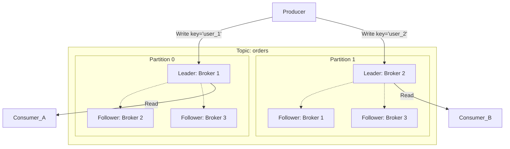

# Kafka: Topics, Partitions, Replication

## 📖 DevOps-история: Боль и Решение

**Боль:** В приложении был один большой топик `orders`, который обрабатывал один Consumer. Когда количество заказов выросло в 100 раз, Consumer перестал справляться, появился огромный лаг (consumer lag), пользователи часами ждали подтверждения заказа. Запуск дополнительных экземпляров Consumer-а не помог, так как Kafka не позволяет двум консьюмерам из одной группы одновременно читать одну и ту же партицию. К тому же, при падении сервера (брокера) данные временно становились недоступны.

**Решение:** Топик разбили на несколько **Partitions** (например, 50). Это позволило запустить 50 экземпляров Consumer-а параллельно (горизонтальное масштабирование). Для надежности настроили **Replication Factor** = 3. Теперь при падении брокера другой брокер прозрачно для клиентов становится лидером партиции, и обработка заказов не останавливается.

## 🏗 Как устроены Топики и Партиции



## 💻 Примеры и Команды

### Изменение количества партиций и репликации
```bash
# Увеличение количества партиций до 10 (ВНИМАНИЕ: уменьшать нельзя!)
kafka-topics.sh --alter --topic orders --partitions 10 --bootstrap-server localhost:9092

# Описание топика (посмотреть, где лидеры и ISR)
kafka-topics.sh --describe --topic orders --bootstrap-server localhost:9092
```

### Пример вывода --describe
```text
Topic: orders  PartitionCount: 3  ReplicationFactor: 3  Configs: min.insync.replicas=2
  Topic: orders  Partition: 0  Leader: 1  Replicas: 1,2,3  Isr: 1,2,3
  Topic: orders  Partition: 1  Leader: 2  Replicas: 2,3,1  Isr: 2,3
```
*(Здесь `Isr` — In-Sync Replicas. Если брокер 1 отстал по Partition 1, он выпадает из ISR)*.

## 🛠 Day 2 Operations (Советы по эксплуатации)

*   **`min.insync.replicas`:** Критический параметр для production! Всегда ставьте `replication.factor=3`, `min.insync.replicas=2` и продюсерам `acks=all`. Это гарантирует, что сообщение будет записано как минимум на 2 брокера, прежде чем producer получит "OK".
*   **Балансировка партиций:** Со временем партиции могут распределиться неравномерно (например, после добавления нового брокера). Используйте `kafka-reassign-partitions.sh` для перераспределения данных по кластеру. Рекомендуется делать это в часы наименьшей нагрузки.
*   **Выбор ключа (Partitioning Key):** По умолчанию (без ключа) Kafka раскидывает сообщения по партициям Round-Robin. Если нужен строгий порядок событий для сущности (например, все статусы одного заказа строго по очереди), обязательно используйте ID заказа как ключ.

## ⛔ Антипаттерны

*   **Изменение количества партиций "на лету" с ключами:** Если вы используете ключи (message keys) для маршрутизации сообщений, добавление новых партиций изменит формулу хеширования (`hash(key) % num_partitions`). Одинаковые ключи начнут попадать в разные партиции, ломая гарантию порядка.
*   **Слишком мало партиций на старте:** Увеличить партиции можно, уменьшить — нет. Если выбрать 1-2 партиции, вы ограничите масштабирование консьюмеров (max консьюмеров = max партиций). Но и ставить 1000 партиций "на всякий случай" тоже плохо (overhead на ZK/KRaft). Начинайте с 30-50 для высоконагруженных топиков.
*   **Игнорирование Consumer Lag:** Если партиций 50, а работает 1 консьюмер, он может не справляться. Всегда мониторьте `kafka_consumergroup_lag` и масштабируйте консьюмеров (до количества партиций).
