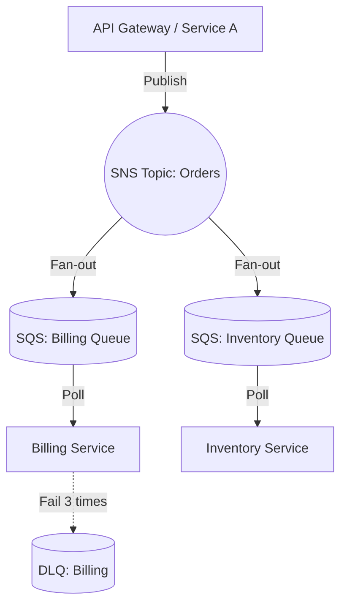

# Cloud Messaging (SQS, SNS, Pub-Sub)

## DevOps-история (Боль и решение)
**Боль:** Монолитное приложение было разделено на микросервисы, но они продолжали общаться синхронно по REST API. При всплесках трафика (например, черная пятница) сервис генерации отчетов не справлялся, таймаутил, и за ним каскадно падали остальные сервисы, ожидающие ответа.
**Решение:** Внедрение асинхронного обмена сообщениями через управляемые облачные сервисы (AWS SQS + SNS, либо GCP Pub/Sub). Сервис-источник просто публикует событие в топик (SNS) и забывает о нем, а сервисы-потребители читают из своих очередей (SQS) в собственном темпе (buffering). Это обеспечило отказоустойчивость, масштабируемость и сняло головную боль по администрированию брокеров.

## Архитектура (Mermaid)



## Примеры (Terraform / AWS)

**Развертывание связки SNS + SQS с помощью Terraform:**
```hcl
resource "aws_sns_topic" "orders" {
  name = "orders-topic"
}

resource "aws_sqs_queue" "billing_queue" {
  name = "billing-queue"
  redrive_policy = jsonencode({
    deadLetterTargetArn = aws_sqs_queue.billing_dlq.arn
    maxReceiveCount     = 3
  })
}

resource "aws_sqs_queue" "billing_dlq" {
  name = "billing-dlq"
}

resource "aws_sns_topic_subscription" "billing_sqs_target" {
  topic_arn = aws_sns_topic.orders.arn
  protocol  = "sqs"
  endpoint  = aws_sqs_queue.billing_queue.arn
}
```

## Советы Day 2 operations
1. **Настройка Dead Letter Queues (DLQ):** Обязательно настраивайте DLQ для всех очередей. Если сообщение не удалось обработать $N$ раз (из-за бага в коде или неверного формата), оно упадет в DLQ для ручного разбора, а не заблокирует очередь (poison pill).
2. **Мониторинг `ApproximateNumberOfMessagesVisible`:** Настройте алерты на рост размера очереди. Это индикатор того, что консьюмеры не справляются с нагрузкой (повод для автоскейлинга консьюмеров).
3. **Visibility Timeout:** Тщательно подбирайте `Visibility Timeout`. Он должен быть больше максимального времени обработки одного сообщения, иначе сообщение станет видимым для других консьюмеров до того, как первый завершит работу, что приведет к дублированию обработки.

## Антипаттерны
- **Mega-Topics:** Использование одного огромного топика/очереди для всех типов событий системы (усложняет маршрутизацию и логику консьюмеров).
- **Синхронное ожидание ответа:** Попытка эмулировать Request-Reply поверх очередей, ожидая ответа в другой очереди с блокировкой треда. Это сводит на нет все плюсы асинхронности.
- **Отсутствие идемпотентности консьюмеров:** В облачных очередях (стандартных) гарантируется доставка "at-least-once". Сообщения могут дублироваться, поэтому обработчики обязаны быть идемпотентными (безопасно обрабатывать один и тот же ID дважды).
