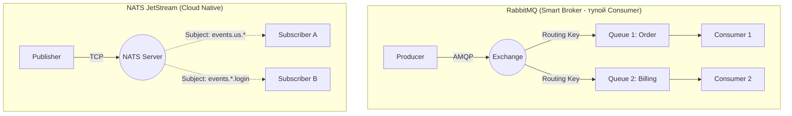

# RabbitMQ, ActiveMQ, NATS

## DevOps-история (Боль и Решение)
**Боль:** Микросервисам нужно обмениваться данными. Синхронные HTTP/gRPC-вызовы порождают жесткую связность (tight coupling), каскадные сбои при падении одного сервиса и не позволяют сглаживать пиковые нагрузки.
**Решение:** Внедрение брокеров сообщений (Message Brokers) для асинхронного взаимодействия.
- **RabbitMQ (Универсальный роутер):** Боль: Классические кластеры RabbitMQ на базе Erlang часто разваливались из-за проблем с сетью ("split-brain"). Решение: Внедрение Quorum Queues (на базе алгоритма Raft) для надежной работы кластера.
- **ActiveMQ (Enterprise Legacy):** Боль: Тяжелый Java-брокер для старых корпоративных систем. Решение: Миграция на более современный ActiveMQ Artemis (высокопроизводительная версия без лишнего багажа).
- **NATS (Cloud-Native ракета):** Боль: RabbitMQ перегружен фичами, а Kafka/Redpanda слишком тяжелы для простых pub/sub задач в Kubernetes-средах. Решение: NATS (написан на Go) — молниеносный, легковесный брокер. Core NATS вообще не хранит сообщения (доставка в памяти), а надстройка JetStream добавляет персистентность и стриминг, закрывая 90% юзкейсов Kafka.

## Схема паттернов маршрутизации


## Примеры
**RabbitMQ (Включение Quorum Queues через политику):**
```bash
# Применение политики: все новые очереди будут создаваться как Quorum Queues (надежные, на базе Raft)
rabbitmqctl set_policy ha-all "^.*" '{"queue-type":"quorum"}' --apply-to queues
```

**NATS (Запуск JetStream в Docker Compose):**
```yaml
version: '3.7'
services:
  nats:
    image: nats:alpine
    command: ["-js"] # Ключевой флаг: включение JetStream для персистентности
    ports:
      - "4222:4222" # Client port
      - "8222:8222" # HTTP monitoring (встроенный легковесный UI)
```

## Day 2 Operations (Эксплуатация)
**RabbitMQ:**
- **Только Quorum Queues:** Откажитесь от классических Mirrored Queues (они объявлены deprecated). Quorum Queues обеспечивают консенсус и избавляют от проблем с синхронизацией нод при сетевых морганиях.
- **Мониторинг:** Активируйте встроенный плагин `rabbitmq_prometheus`. Главная метрика для алертинга — `rabbitmq_queue_messages_ready`. Если она растет бесконечно, консьюмеры не справляются с нагрузкой.

**NATS:**
- **Сборка кластера:** Используйте официальный Helm Chart. NATS кластеризуется элементарно, без сложных танцев с бубном, благодаря встроенному auto-discovery.
- **Траблшутинг:** На порту 8222 доступен встроенный HTTP-сервер. Эндпоинты `/varz` (общая статистика) и `/connz` (информация о подключениях) спасают при дебаге сети без внешних тулзов.

## Антипаттерны
- **RabbitMQ как база данных:** RabbitMQ не предназначен для долгосрочного хранения данных. Если сообщения не вычитываются (очередь пухнет), брокер начнет потреблять всю память и сбрасывать данные на диск (page out), что катастрофически снизит производительность.
- **Core NATS для критичных транзакций:** Core NATS (без JetStream) гарантирует доставку "at most once" (максимум один раз). Если консьюмер упал, сообщение, отправленное в этот момент, будет потеряно навсегда. Для надежной доставки используйте только JetStream.
- **Тупая труба в RabbitMQ:** Использование RabbitMQ просто как прямой очереди (Direct в одну очередь), игнорируя мощь Exchanges (Topic, Fanout, Headers). Переносите логику маршрутизации сообщений с уровня кода приложения на уровень брокера (в Exchange).
