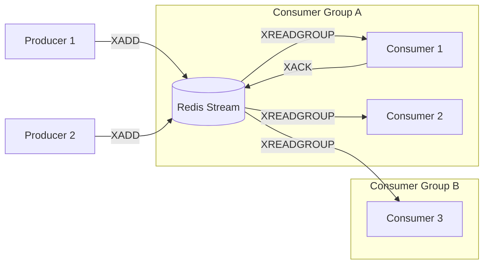

# Redis Streams: Легковесный Event Sourcing

## DevOps-история (Боль и решение)
**Боль:** В проекте было несколько микросервисов, которым нужно было обмениваться событиями (например, создание заказа). Поднимать и обслуживать кластер Apache Kafka ради небольшого потока событий было слишком "дорого" с точки зрения ресурсов и времени администрирования. RabbitMQ казался избыточным для простых логов событий.
**Решение:** Использование уже существующего в инфраструктуре Redis, но не классического Pub/Sub (где события теряются, если подписчик отключен), а структуры данных **Redis Streams**. Это дало персистентность событий, поддержку Consumer Groups (балансировка нагрузки) и простоту эксплуатации.

## Архитектура (Mermaid)



## Примеры (CLI)

**Добавление события в стрим:**
```bash
# XADD stream_name * key1 value1 key2 value2
redis-cli XADD orders * order_id 1234 status "created" user_id 567
# Вернет ID сообщения, например: 1692123456789-0
```

**Создание Consumer Group:**
```bash
# Создаем группу, начинаем читать с начала (0) или с текущего момента ($)
redis-cli XGROUP CREATE orders group_processing 0 MKSTREAM
```

**Чтение и подтверждение:**
```bash
# Читаем новые сообщения (>) для consumer_1 из group_processing
redis-cli XREADGROUP GROUP group_processing consumer_1 COUNT 1 STREAMS orders >
# Подтверждаем обработку
redis-cli XACK orders group_processing 1692123456789-0
```

## Советы Day 2 operations
1. **Управление памятью:** Redis хранит всё в RAM. Обязательно ограничивайте размер стрима при записи: `XADD orders MAXLEN ~ 100000 * order_id 123`. Символ `~` означает примерное усечение (более эффективно).
2. **Мониторинг:** Следите за метриками `consumer_lag` и длиной `PEL` (Pending Entries List). Если PEL растет, консьюмеры не делают `XACK`.
3. **Обработка упавших консьюмеров (Dead Consumers):** Используйте команду `XPENDING` для поиска зависших сообщений и `XCLAIM` для передачи их другим, живым консьюмерам.

## Антипаттерны
- **Бесконечные стримы без MAXLEN:** Приведет к OOM (Out of Memory) и падению всего инстанса Redis.
- **Игнорирование XACK:** Сообщения будут накапливаться в PEL, потребляя память и искажая логику доставки.
- **Использование для огромных пейлоадов:** Redis Streams хорош для метаданных событий. Тяжелые бинарники лучше хранить в S3, а в стрим передавать только ссылку.
