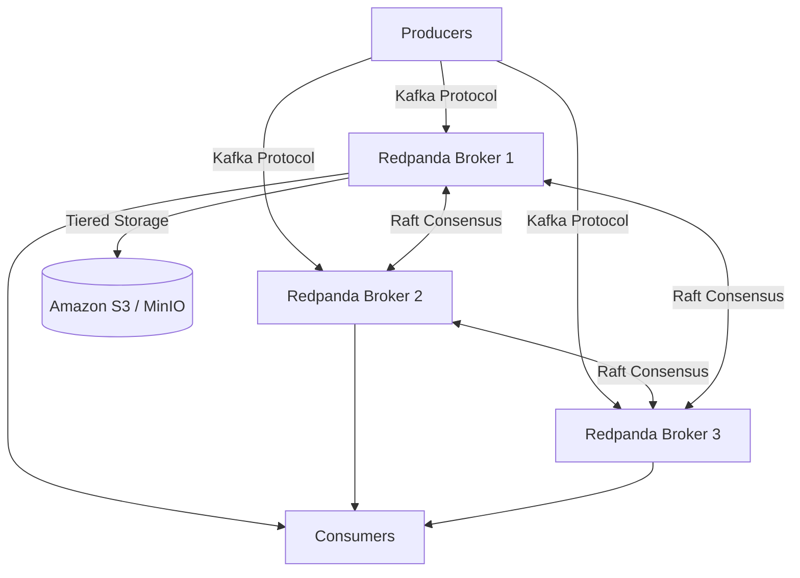

# Redpanda (Современная замена Kafka)

## DevOps-история (Боль и Решение)
**Боль:** Apache Kafka — отличный, надежный и проверенный временем брокер (стандарт де-факто для Event-Driven Architecture). Однако его эксплуатация — это боль. Требуется управление JVM (настройка сборщика мусора, тюнинг хипа), обслуживание ZooKeeper (или сложный переход на KRaft), а инфраструктура потребляет много памяти и CPU.
**Решение:** Redpanda. Это брокер, написанный на C++ (фреймворк Seastar), работающий без JVM и ZooKeeper, но полностью совместимый с API Kafka. Он предоставляет предсказуемо низкие задержки, управляется как единый бинарный файл, использует архитектуру thread-per-core и "из коробки" умеет сбрасывать старые данные в S3 (Tiered Storage).

## Архитектура


## Примеры
**Docker Compose для локальной разработки:**
```yaml
version: '3.7'
services:
  redpanda:
    image: docker.redpanda.com/redpandadata/redpanda:latest
    container_name: redpanda
    command:
      - redpanda
      - start
      - --smp 1 # Ограничение на 1 ядро
      - --memory 1G
      - --reserve-memory 0M
      - --overprovisioned
      - --node-id 0
      - --kafka-addr internal://0.0.0.0:9092,external://0.0.0.0:19092
      - --advertise-kafka-addr internal://redpanda:9092,external://localhost:19092
    ports:
      - "19092:19092"
      - "9644:9644" # Prometheus metrics
      - "8081:8081" # Schema Registry
```

**Работа через CLI (`rpk`):**
```bash
# rpk (Redpanda Keeper) - встроенная утилита, заменяющая монструозные скрипты kafka-*.sh
rpk topic create my-topic -p 3 -r 1
rpk topic produce my-topic
rpk cluster info
```

## Day 2 Operations (Эксплуатация)
- **Мониторинг:** Метрики в формате Prometheus доступны "из коробки" на порту 9644 (эндпоинт `/metrics`). Не нужно настраивать JMX Exporter и собирать сложные дашборды, как в Kafka.
- **Масштабирование:** Добавление новой ноды в кластер требует только указания адресов существующих seed-серверов. Ребалансировка партиций происходит автоматически без вмешательства инженера.
- **Управление стоимостью (Tiered Storage):** Настройте автоматический перенос холодных данных в объектное хранилище (S3/GCS). Это позволяет хранить бесконечную историю событий, не разоряясь на дорогих локальных NVMe-дисках.

## Антипаттерны
- **Использование медленных дисков (HDD/Сетевые тома):** Redpanda спроектирована для работы на локальных NVMe SSD. Использование медленных дисков (например, стандартных EBS) убьет все преимущества производительности C++ из-за высоких задержек ввода-вывода.
- **Запуск вместе с прожорливыми соседями:** Архитектура thread-per-core подразумевает жесткую привязку треда к ядру CPU. Если на той же ноде крутятся ресурсоемкие процессы (CPU steal time), это приведет к непредсказуемым задержкам (latency spikes). Выделяйте dedicated-инстансы.
