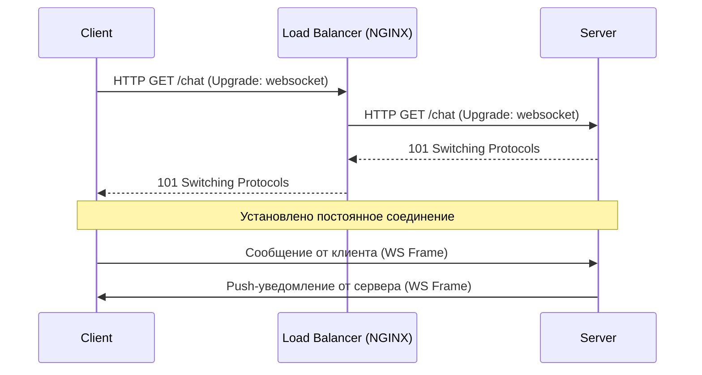

# WebSockets в DevOps

## 📖 История: Боль и Решение
**Боль:** Клиентским приложениям требовалось получать обновления в реальном времени. Мы начали с HTTP Polling (опрос каждые 2 секунды), что привело к огромному оверхеду на создание соединений, перегрузке балансировщиков и задержкам передачи данных.
**Решение:** Переход на WebSockets. Одно постоянное TCP-соединение обеспечило дуплексную (двунаправленную) связь. Задержки снизились, потребление CPU на балансировщиках упало в разы, а клиенты стали получать push-сообщения мгновенно.

## 🏗 Архитектура


## 🛠 Примеры

### NGINX: Проксирование WebSockets
Чтобы балансировщик не обрывал WebSocket-соединения, нужно правильно настроить проксирование заголовков и увеличить таймауты.
```nginx
map $http_upgrade $connection_upgrade {
    default upgrade;
    ''      close;
}

server {
    listen 80;
    server_name ws.example.com;

    location / {
        proxy_pass http://backend_servers;
        proxy_http_version 1.1;
        
        # Ключевые заголовки для WebSockets
        proxy_set_header Upgrade $http_upgrade;
        proxy_set_header Connection $connection_upgrade;
        proxy_set_header Host $host;
        
        # Таймауты для неактивных соединений
        proxy_read_timeout 3600s;
        proxy_send_timeout 3600s;
    }
}
```

## 🌅 Day 2 Operations (Жизнь после релиза)
- **Горизонтальное масштабирование:** WebSocket-серверы stateful (хранят состояние соединений). Для масштабирования (Scale Out) используйте паттерн Pub/Sub (например, Redis Pub/Sub или RabbitMQ) для синхронизации броадкаст-сообщений между инстансами бэкенда.
- **Мониторинг:** Отслеживайте специфичные метрики: количество активных соединений (Active connections), rate создания/обрывов соединений, задержку (latency) ответов.
- **Connection Draining (Graceful Shutdown):** При деплое нового релиза корректно закрывайте соединения. Балансировщик должен перестать слать новый трафик на завершающийся под, а приложение должно разослать клиентам команду на переподключение перед завершением работы.

## 🚫 Антипаттерны
- **Отсутствие Heartbeats (Ping/Pong):** Без них TCP-соединение может "зависнуть" (например, отвалится NAT-сессия у провайдера), и сервер не узнает, что клиент пропал, что приведет к утечкам ресурсов (FD, память).
- **Слишком большие Payload'ы:** WebSockets не предназначены для передачи больших файлов (видео, дампов). Разделяйте сигнальный/реалтайм трафик (WebSockets) и тяжелый (HTTP/S3).
- **Sticky Sessions как замена архитектуры:** Использование привязки к сессии (session affinity) на балансировщике вместо нормальной шины сообщений. При падении инстанса все его клиенты отвалятся без возможности корректного восстановления состояния на другом узле.
