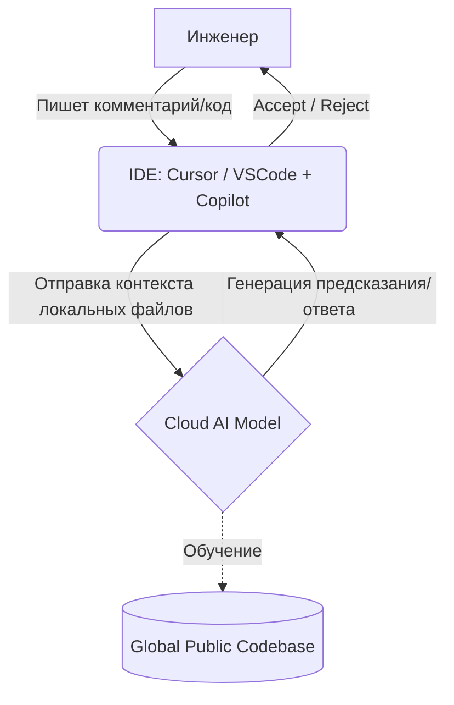

# AI-Ассистенты (GitHub Copilot, Cursor)

## История (Боль и Решение)
**Боль:** Разработчики и DevOps-инженеры тратят огромную часть времени на написание шаблонного (boilerplate) кода, поиск синтаксиса Kubernetes манифестов или bash-команд, а также отладку тривиальных ошибок. Это замедляет разработку и приводит к выгоранию.
**Решение:** Внедрение AI-ассистентов на базе LLM (Large Language Models) прямо в IDE (GitHub Copilot, Cursor). Они анализируют контекст проекта и предлагают автодополнение целых блоков кода, генерируют тесты, пишут документацию и объясняют легаси-код, превращая часы рутины в минуты.

## Архитектура (Mermaid)


## Примеры использования

### Промпт для генерации GitHub Actions
В пустом файле `.github/workflows/deploy.yml` пишем комментарий:
```yaml
# Generate a GitHub Actions workflow that:
# 1. Triggers on push to main branch
# 2. Builds a Docker image using Dockerfile in root
# 3. Pushes to GHCR
# 4. Deploys to Kubernetes using kubectl applying k8s/deployment.yaml

name: Build and Deploy
on:
  push:
    branches:
      - main
# ... далее AI генерирует остальной код пайплайна
```

### Рефакторинг с Cursor
Выделяем кусок bash-скрипта и нажимаем `Ctrl+K` (или `Cmd+K`):
> "Rewrite this script to use 'set -euo pipefail' and add proper error handling with informative echo messages."

## Day 2 Operations (Сопровождение)
- **Контроль качества (Code Review):** AI может галлюцинировать. Обязательное ревью сгенерированного кода человеком, особенно в части security, прав доступа (IAM) и деструктивных операций.
- **Управление контекстом:** Поддерживайте чистоту репозитория и модульность кода. Качество ответов AI напрямую зависит от контекста (какие файлы открыты в IDE, структура проекта).
- **AI Policies:** Внедрение корпоративных правил использования AI, чтобы избежать утечки проприетарного кода.

## Антипаттерны
- **Слепое доверие:** Принятие сгенерированного кода без понимания, как он работает.
- **Передача секретов:** Написание паролей, ключей или токенов в комментариях с надеждой, что AI "поймет" контекст. Эти данные могут улететь на сервера OpenAI/GitHub.
- **Отказ от фундаментальных знаний:** Использование AI как полной замены изучения синтаксиса, устройства сетей и принципов работы инструментов.
