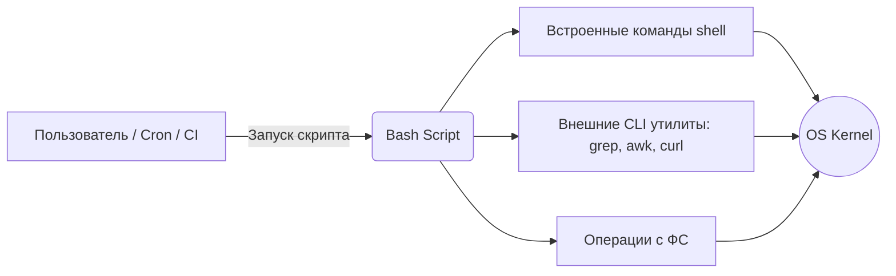

# Bash

## История (Боль и Решение)
**Боль:** Администраторам и DevOps-инженерам приходится выполнять сотни рутинных операций (настройка серверов, парсинг логов, бекапы, деплой) вручную. Это медленно, невоспроизводимо и неизбежно приводит к ошибкам человеческого фактора ("fat finger errors").
**Решение:** Использование Bash (Bourne Again SHell) — стандартного интерпретатора командной строки и языка сценариев в Linux. Написание скриптов позволяет автоматизировать рутину, связывая различные утилиты CLI в единый, переиспользуемый пайплайн.

## Архитектура (Mermaid)


## Примеры

### Надежный Bash-скрипт (Best practices)
Шаблон для безопасного написания скриптов:
```bash
#!/usr/bin/env bash

# set -e: скрипт падает при первой ошибке
# set -u: скрипт падает при использовании необъявленных переменных
# set -o pipefail: скрипт падает, если любая команда в pipe завершилась с ошибкой
set -euo pipefail

# Устанавливаем строгий разделитель
IFS=$'\n\t'

LOG_DIR="/var/log/myapp"
BACKUP_DIR="/backup"

# Проверка наличия директории
if [[ ! -d "$LOG_DIR" ]]; then
  echo "Error: Log directory $LOG_DIR does not exist." >&2
  exit 1
fi

# Архивация с проверкой переменных
tar -czf "${BACKUP_DIR}/logs-$(date +%F).tar.gz" -C "$LOG_DIR" .
echo "Backup completed successfully."
```

## Day 2 Operations (Сопровождение)
- **Линтинг (ShellCheck):** Обязательное использование утилиты `shellcheck` локально и в CI/CD пайплайнах для статического анализа кода скриптов. Она находит 90% типичных ошибок (например, неэкранированные переменные).
- **Логирование и Дебаг:** Выводите понятные сообщения через `echo` или `logger`. Для отладки используйте запуск скрипта с флагом `bash -x ./script.sh`, но будьте осторожны, чтобы не вывести секреты в CI-логи.
- **Graceful Shutdown (trap):** Используйте команду `trap` для очистки временных файлов и корректного завершения работы при прерывании скрипта (например, по Ctrl+C).

## Антипаттерны
- **Bash для сложных систем:** Использование Bash для сложной бизнес-логики, активной работы с JSON/YAML, сложного парсинга текста или API-взаимодействий. Когда скрипт перерастает 100-200 строк, лучше переписать его на Python или Go.
- **Игнорирование ошибок:** Выполнение команд, зависящих друг от друга, без проверок. Например, `cd /some/dir && rm -rf *` безопаснее, чем выполнение их на разных строках (если `cd` упадет, `rm` удалит текущую директорию).
- **Неэкранированные переменные:** Использование `$VAR` вместо `"$VAR"`. Если переменная содержит пробелы, Bash воспримет ее как несколько аргументов, что сломает скрипт.
