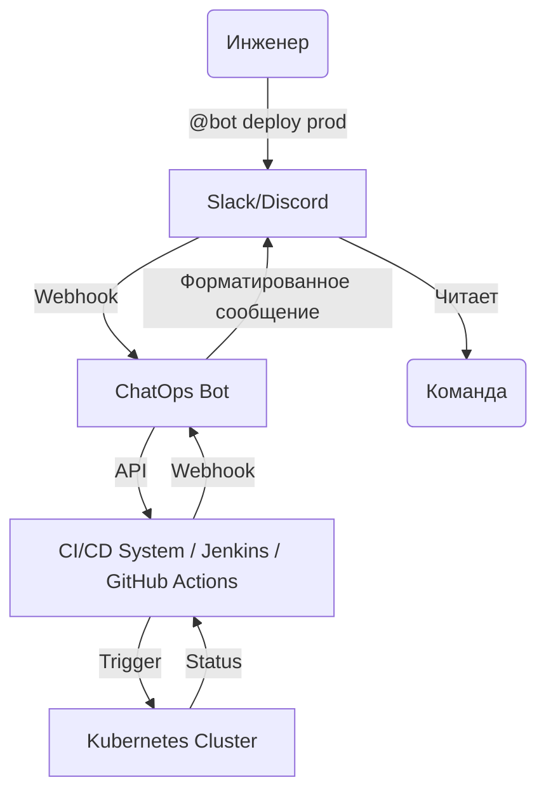

# ChatOps

## 📖 DevOps-история: Боль и Решение
**Боль:** Команда не понимает, кто и когда запустил деплой. Инциденты обсуждаются в мессенджере, метрики смотрятся в Grafana, а логи — в Kibana. Контекст теряется, онбординг новых сотрудников превращается в ад из-за "тайных знаний", спрятанных в терминалах отдельных инженеров.
**Решение:** ChatOps — перенос управления инфраструктурой и CI/CD в корпоративный мессенджер (Slack, Teams, Discord). Бот становится общим терминалом: команды, алерты и результаты видны всей команде, формируя "естественный лог" действий.

## 📊 Архитектура (Mermaid)


## 💻 Примеры

### Интеграция Alertmanager со Slack (YAML)
```yaml
# alertmanager.yml
receivers:
- name: 'slack-notifications'
  slack_configs:
  - api_url: 'https://hooks.slack.com/services/T0000/B0000/XXXXX'
    channel: '#alerts-prod'
    title: '{{ template "slack.default.title" . }}'
    text: '{{ template "slack.default.text" . }}'
    send_resolved: true
```

### Простая команда ChatOps (Bash + GitHub Actions)
Пользователь пишет `/deploy frontend` в Slack. Slack шлет POST-запрос на GitHub:
```bash
curl -X POST -H "Accept: application/vnd.github.v3+json" \
  -H "Authorization: token $GITHUB_TOKEN" \
  https://api.github.com/repos/org/repo/actions/workflows/deploy.yml/dispatches \
  -d '{"ref":"main", "inputs": {"service": "frontend", "env": "prod"}}'
```

## 🛠 Советы Day 2 Operations
- **Интерактивность:** Используйте кнопки, выпадающие списки и модальные окна в чате (например, Slack Block Kit), чтобы уменьшить вероятность опечаток при вводе команд.
- **Аудит и RBAC:** Ограничивайте права. Не каждый в канале должен иметь право выполнить `@bot drop database`. Логируйте все ChatOps-действия в центральную систему аудита.
- **Подтверждение действий (Two-phase commit):** Для деструктивных команд бот должен отвечать: "Вы уверены? Нажмите [Approve]".
- **Треды (Threads):** Бот должен отвечать в тред к оригинальному сообщению, чтобы не засорять основной канал потоком логов.

## 🚫 Антипаттерны
- **Усталость от алертов (Notification Fatigue):** Спам в канал обо всех минорных событиях. Команда быстро начнет игнорировать или замьютит канал.
- **Секреты в чате:** Передача паролей или токенов через команды (например, `@bot set-password --pass=123`). Логи чата часто хранятся бесконечно и индексируются.
- **ChatOps как единственный способ:** Отсутствие альтернативного пути (API/CLI) для выполнения действий, если мессенджер упадет.
- **Слишком долгий фидбек:** Запуск команды без мгновенного ответа от бота "Принято в работу, ожидайте". Инженер может подумать, что ничего не произошло, и запустить деплой повторно.
