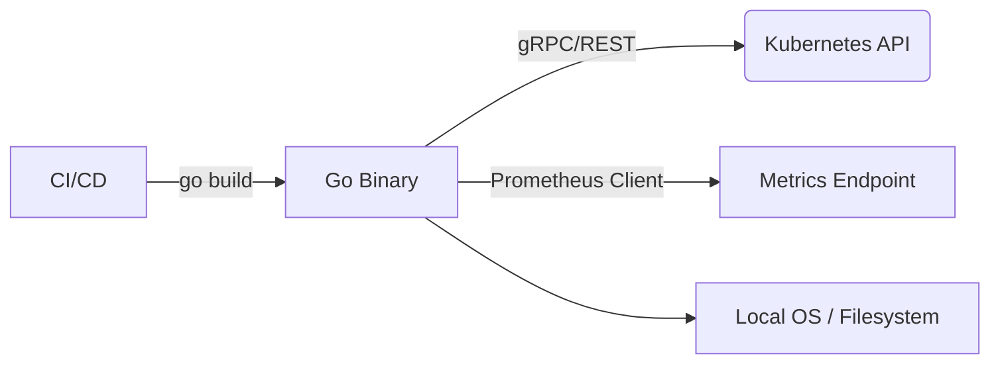

# Go для DevOps

## История: Быстро, надежно и без зависимостей
**Боль:** Инфраструктурные утилиты на скриптовых языках (Python/Ruby) ломались на серверах из-за отсутствия нужных версий интерпретатора, библиотек или конфликтов зависимостей, а скорость работы оставляла желать лучшего.
**Решение:** Переписывание критичных агентов и утилит на Go. Статическая типизация, выдающаяся производительность, встроенная поддержка конкурентности и компиляция в один статический бинарник без внешних зависимостей.

## Место Go в инфраструктуре



## Примеры

### Простой экспортер метрик и парсинг конфига
```go
package main

import (
	"fmt"
	"log"
	"net/http"
	"os"

	"github.com/prometheus/client_golang/prometheus"
	"github.com/prometheus/client_golang/prometheus/promhttp"
)

var (
	opsProcessed = prometheus.NewCounter(prometheus.CounterOpts{
		Name: "myapp_processed_ops_total",
		Help: "The total number of processed operations",
	})
)

func init() {
	prometheus.MustRegister(opsProcessed)
}

func main() {
	port := os.Getenv("PORT")
	if port == "" {
		port = "8080"
	}

	http.HandleFunc("/", func(w http.ResponseWriter, r *http.Request) {
		opsProcessed.Inc()
		fmt.Fprintf(w, "Hello, DevOps!")
	})
	
	http.Handle("/metrics", promhttp.Handler())

	log.Printf("Starting server on port %s", port)
	log.Fatal(http.ListenAndServe(":"+port, nil))
}
```

## Day 2 Operations
- **Тестирование:** Пишите unit-тесты (`go test`) и используйте `testcontainers-go` для интеграционного тестирования с базами данных или Redis.
- **Управление ошибками:** Всегда проверяйте ошибки (`if err != nil`). Оборачивайте их с помощью `fmt.Errorf("doing X: %w", err)` для сохранения контекста.
- **Ограничение ресурсов:** При использовании горутин (`goroutines`) используйте `context` с таймаутами или отменой, чтобы предотвратить утечки горутин.
- **Сборка:** Используйте многоэтапные (multi-stage) Docker-сборки (`FROM golang:alpine as builder` -> `FROM scratch`), чтобы получать образы размером в несколько мегабайт.

## Антипаттерны
- ❌ **Паника вместо возврата ошибки:** Использование `panic()` в бизнес-логике. Паника должна использоваться только для невосстановимых фатальных ошибок при старте.
- ❌ **Игнорирование Context:** Передача `context.Background()` везде, вместо прокидывания контекста сверху вниз для правильного управления таймаутами и отменой.
- ❌ **Глобальное состояние:** Использование множества глобальных переменных вместо внедрения зависимостей (DI) в структуры, что делает код нетестируемым.
