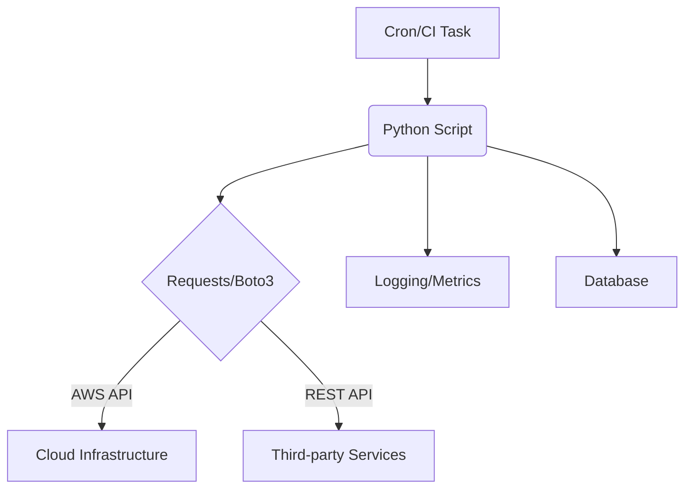

# Python для DevOps

## История: От Bash-лапши к поддерживаемой автоматизации
**Боль:** Сотни строк Bash-скриптов для деплоя и бэкапов стали нечитаемыми, обработка ошибок превратилась в ад, а передача знаний новым сотрудникам занимала недели.
**Решение:** Переход на Python. Структурированный код, богатая стандартная библиотека, нормальная обработка исключений и возможность использовать ООП/модули позволили создавать надежные CLI-утилиты и скрипты автоматизации.

## Архитектура автоматизации



## Примеры

### CLI утилита с Click и Rich
```python
import click
import requests
from rich.console import Console

console = Console()

@click.command()
@click.option('--url', default='http://localhost:8080/health', help='URL для проверки статуса')
def check_health(url):
    """Проверяет Healthcheck сервиса"""
    try:
        response = requests.get(url, timeout=5)
        response.raise_for_status()
        console.print(f"[bold green]Успех![/bold green] Сервис доступен (HTTP 200).")
    except requests.exceptions.RequestException as e:
        console.print(f"[bold red]Ошибка![/bold red] Сервис недоступен: {e}")

if __name__ == '__main__':
    check_health()
```

## Day 2 Operations
- **Управление зависимостями:** Используйте `Poetry` или `pipenv` вместо обычного `requirements.txt` для фиксирования версий.
- **Линтинг и форматирование:** Интегрируйте `black`, `isort`, `flake8` или `ruff` в CI/CD и pre-commit хуки.
- **Логирование:** Используйте модуль `logging` в формате JSON (например, через `python-json-logger`), чтобы логи было удобно парсить в ELK/Loki.
- **Типизация:** Повсеместно используйте type hints (аннотации типов) и проверяйте их с помощью `mypy`.

## Антипаттерны
- ❌ **Использование `os.system` или `subprocess.Popen` без необходимости:** Вместо вызова shell-команд, используйте нативные библиотеки (например, `docker-py` вместо `subprocess.run("docker ...")`).
- ❌ **Проглатывание исключений:** Конструкции вроде `except Exception: pass` скрывают реальные проблемы в автоматизации.
- ❌ **Хардкод секретов:** Хранение токенов в коде. Используйте переменные окружения, `python-dotenv` или Vault.
