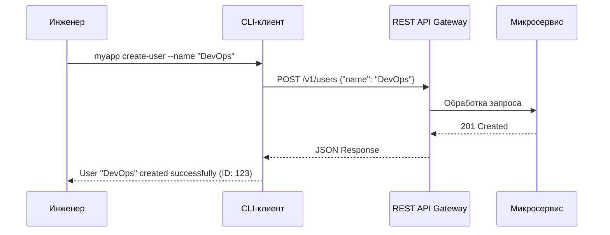

# REST API и CLI Design

## 📖 DevOps-история: Боль и Решение
**Боль:** Инженеры тратят часы на "прокликивание" веб-интерфейсов для настройки инфраструктуры или пишут хрупкие bash-скрипты поверх SSH. При масштабировании процессы ломаются, а автоматизация становится невозможной.
**Решение:** Создание понятных REST API для сервисов и удобных CLI-оберток (Command Line Interface) над ними. Это позволяет автоматизировать рутину, интегрировать системы между собой и управлять ими как кодом (IaC).

## 📊 Архитектура (Mermaid)


## 💻 Примеры

### REST API: Пример запроса (Bash/curl)
```bash
# Получение статуса кластера
curl -s -X GET "https://api.example.com/v1/cluster/status" \
  -H "Authorization: Bearer $API_TOKEN" \
  -H "Accept: application/json" | jq .
```

### CLI Design: Пример на Python (Click)
```python
import click
import requests

@click.group()
def cli():
    """Инструмент управления инфраструктурой."""
    pass

@cli.command()
@click.option('--name', required=True, help='Имя ресурса')
def create(name):
    """Создает новый ресурс."""
    response = requests.post("https://api.example.com/v1/resources", json={"name": name})
    if response.status_code == 201:
        click.secho(f"Успех! Ресурс {name} создан.", fg="green")
    else:
        click.secho(f"Ошибка: {response.text}", fg="red")

if __name__ == '__main__':
    cli()
```

## 🛠 Советы Day 2 Operations
- **Версионирование:** Всегда версионируйте API (например, `/v1/`, `/v2/`). Для CLI поддерживайте предупреждения о депрекации (Deprecation Warnings).
- **Пагинация и Rate Limiting:** Реализуйте ограничения запросов и пагинацию (cursor-based) для защиты бэкенда от перегрузок.
- **Машиночитаемый вывод в CLI:** Добавьте флаг `--output json` или `-o yaml` в CLI, чтобы результаты команд можно было парсить скриптами (например, через `jq`).
- **Идемпотентность:** Повторные вызовы одних и тех же API-эндпоинтов (особенно PUT/DELETE) не должны приводить к неожиданным побочным эффектам.

## 🚫 Антипаттерны
- **Протечка абстракций:** Возврат внутренних ошибок базы данных или стектрейсов напрямую в API.
- **Болтливый CLI:** Слишком много текста по умолчанию в CLI-инструменте, что мешает использовать его в CI/CD pipeline (отсутствие "тихого" режима, флага `-q`).
- **Нестандартные HTTP-коды:** Использование 200 OK для ошибок, передача статуса ошибки только внутри JSON-тела.
- **Управление состоянием в CLI:** CLI должен быть максимально "тупым" (stateless proxy к API). Вся бизнес-логика должна жить на сервере.
