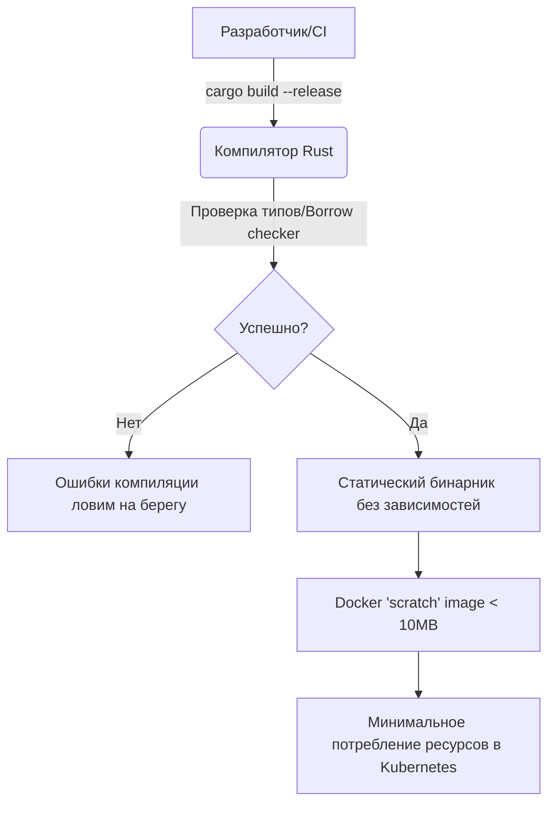

# Rust для DevOps

## 📖 DevOps-история: Боль и Решение
**Боль:** Инфраструктурные скрипты на Bash быстро превращаются в нечитаемую "лапшу" при усложнении логики. Утилиты на Python требуют наличия интерпретатора, потребляют больше памяти в легковесных контейнерах и могут упасть в рантайме из-за опечатки или необработанного исключения. Go популярен, но иногда нужен еще более жесткий контроль над ресурсами и предсказуемое время отклика без пауз сборщика мусора (GC).
**Решение:** Rust. Он позволяет собирать крошечные статически слинкованные бинарники (идеально для пустых `scratch` образов), потребляет минимум оперативной памяти, а его строгий компилятор ловит 99% багов еще до деплоя. Это идеальный выбор для CLI-инструментов, Kubernetes-операторов (через `kube-rs`) и высоконагруженных сетевых прокси.

## 🏗 Архитектура: Интеграция Rust


## 💻 Примеры

### Пример 1: Мультистейдж Dockerfile (идеально для DevOps)
```dockerfile
# Сборка статического бинарника
FROM rust:1.75 as builder
WORKDIR /usr/src/app
COPY . .
# Добавляем target для статической линковки (musl)
RUN rustup target add x86_64-unknown-linux-musl
RUN cargo build --release --target x86_64-unknown-linux-musl

# Продакшен образ без ОС
FROM scratch
COPY --from=builder /usr/src/app/target/x86_64-unknown-linux-musl/release/my-devops-cli /
ENTRYPOINT ["/my-devops-cli"]
```

### Пример 2: Простой CLI с крейтом `clap`
```rust
// cargo add clap --features derive
use clap::Parser;

#[derive(Parser)]
#[command(author, version, about, long_about = None)]
struct Cli {
    /// Имя окружения для деплоя
    #[arg(short, long)]
    env: String,
}

fn main() {
    let cli = Cli::parse();
    println!("🚀 Начинаем деплой в окружение: {}", cli.env);
    // Благодаря Rust, если программа скомпилировалась, 
    // вероятность внезапного падения (SegFault, NPE) стремится к нулю.
}
```

## 🛠 Day 2 Operations
- **Безопасность:** Регулярно запускайте `cargo audit` в ваших CI/CD пайплайнах. Это инструмент для проверки известных уязвимостей в дереве зависимостей (crates).
- **Мониторинг/Логирование:** Вместо использования обычных `println!` или простых логгеров, сразу интегрируйте библиотеку `tracing`. Она позволяет писать структурированные логи и легко интегрируется с распределенной трассировкой (OpenTelemetry).
- **Оптимизация CI:** Компиляция кода на Rust занимает много времени. Обязательно настройте кэширование (например, `sccache` или просто кэшируйте папки `target/` и `~/.cargo/registry` в GitLab CI / GitHub Actions), чтобы ускорить сборку.

## 🚫 Антипаттерны
1. **Переписывание 5-строчных bash-скриптов на Rust.** Не усложняйте. Если задача решается простым bash/jq без сложной бизнес-логики и ветвлений, Rust будет явным оверкиллом.
2. **Повсеместное использование `.unwrap()`.** В продакшен-коде это приведет к паникам (crashes). Всегда используйте оператор `?` и нормальную обработку ошибок (например, с помощью крейтов `anyhow` или `thiserror`).
3. **Игнорирование `cargo clippy`.** Линтер в Rust (`clippy`) — ваш наставник и лучший друг. Никогда не отключайте его предупреждения, он учит писать идиоматичный и безопасный код.
