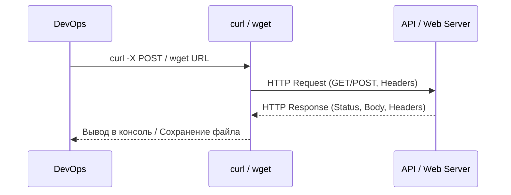

# Работа с сетью (curl, wget)

## 📖 История: Боль и Решение
**Боль:** Приложение в Kubernetes не может подключиться к базе данных. Или CI-скрипту нужно скачать бинарник с GitHub Releases. Писать для таких базовых задач скрипты на Python долго и избыточно, а дебажить сетевые проблемы без инструментов — как искать черную кошку в темной комнате.
**Решение:** `curl` и `wget` — швейцарские ножи для работы с сетью в консоли. Они позволяют проверять связность, отправлять API-запросы, тестировать заголовки и скачивать артефакты прямо из bash-скриптов.

## 🏗 Архитектура / Схема работы



## 🛠 Примеры использования

### 1. Проверка связности и дебаг HTTP
Посмотреть все этапы подключения, включая TLS-хэндшейк и заголовки ответа:
```bash
curl -vI https://api.example.com
```

### 2. Отправка POST-запроса (JSON)
Триггернуть вебхук или API-эндпоинт:
```bash
curl -X POST https://api.example.com/v1/trigger \
  -H "Content-Type: application/json" \
  -H "Authorization: Bearer $TOKEN" \
  -d '{"environment": "production", "action": "deploy"}'
```

### 3. Скачивание артефактов (wget/curl)
Надежное скачивание файла с повторными попытками при разрыве:
```bash
# Использование wget
wget --retry-connrefused --waitretry=1 --read-timeout=20 --timeout=15 -t 3 https://example.com/app.tar.gz

# Использование curl (полезно в Alpine Linux, где wget часто урезан)
curl -O -L -C - --retry 3 https://example.com/app.tar.gz
```

## 🌅 Day 2 Operations (Советы)
- **Таймауты — это святое:** В CI-пайплайнах всегда указывайте `--max-time` (`-m`) для `curl` или `--timeout` для `wget`. Иначе скрипт может зависнуть навсегда, ожидая ответа от мертвого сервера.
- **Следование за редиректами:** В `curl` по умолчанию отключено следование за 3xx редиректами. Не забывайте флаг `-L` (`--location`), особенно при скачивании артефактов.
- **Тихий режим в скриптах:** Используйте `curl -sS` в скриптах: `-s` скроет прогресс-бар, а `-S` оставит вывод ошибок, если что-то пойдет не так.

## 🚫 Антипаттерны
- **Передача секретов в URL:** Никогда не передавайте токены в URL (`curl https://api.com?token=secret`). Они осядут в истории shell и логах серверов. Используйте заголовки (`-H`).
- **Слепое выполнение `curl | bash`:** Классический паттерн установки софта. Вы не знаете, что именно скачается и выполнится. Сначала скачайте, проверьте скрипт, потом запускайте.
- **Игнорирование HTTP-кодов:** `curl` завершается с кодом `0`, даже если сервер вернул `404` или `500`. Используйте флаг `-f` (`--fail`), чтобы `curl` возвращал ошибку при неудачных HTTP-ответах.
