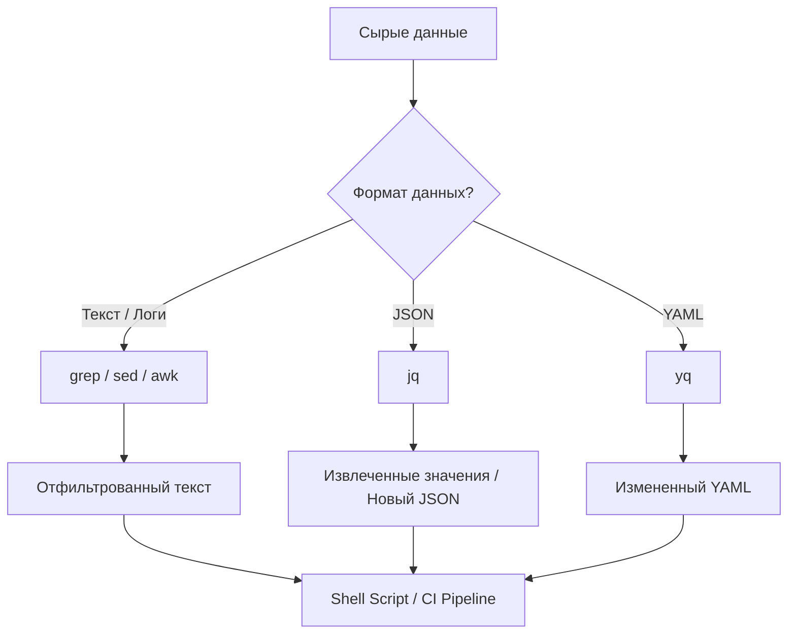

# Утилиты парсинга (jq, yq, grep, sed, awk)

## 📖 История: Боль и Решение
**Боль:** Логи льются рекой, конфигурации Kubernetes хранятся в огромных YAML-файлах, а из JSON-ответов API нужно достать одно конкретное поле. Открывать всё это в редакторе и искать вручную — путь к выгоранию и ошибкам.
**Решение:** Консольные утилиты для парсинга и обработки текста. `grep` находит нужное, `awk` и `sed` преобразуют текст, а `jq` и `yq` элегантно работают со структурированными данными (JSON/YAML), превращая хаос в упорядоченный пайплайн.

## 🏗 Архитектура / Схема работы



## 🛠 Примеры использования

### 1. jq (Работа с JSON)
Извлечь имена всех подов в статусе "Running":
```bash
kubectl get pods -o json | jq -r '.items[] | select(.status.phase=="Running") | .metadata.name'
```

### 2. yq (Работа с YAML)
Изменить версию образа в deployment.yaml:
```bash
yq e '.spec.template.spec.containers[0].image = "nginx:1.25.0"' -i deployment.yaml
```

### 3. grep, sed, awk (Работа с текстом)
Найти ошибки в логах, заменить "ERROR" на "CRITICAL" и вывести только время и сообщение:
```bash
cat app.log | grep "ERROR" | sed 's/ERROR/CRITICAL/g' | awk '{print $1, $2, $5}'
```

## 🌅 Day 2 Operations (Советы)
- **Версионирование бинарников:** В CI/CD пайплайнах жестко фиксируйте версии `jq` и `yq`. Синтаксис `yq` v3 и v4 кардинально отличается!
- **Читаемость пайплайнов:** Если ваш пайплайн `sed | awk | grep` занимает больше 3 строк, перепишите его на Python или Go для поддержки.
- **Использование `-r` в jq:** Всегда используйте флаг `-r` (raw-output) в `jq` при передаче значений в bash-переменные, чтобы избежать лишних кавычек в строках.

## 🚫 Антипаттерны
- **Парсинг JSON/YAML с помощью `grep` или `sed`:** Регулярные выражения не понимают структуру JSON. Используйте профильные инструменты (`jq`/`yq`).
- **Слепое использование `-i` в `sed` и `yq`:** Всегда тестируйте команду без изменения файла на месте (in-place), или делайте бэкап, прежде чем запускать в проде.
- **Игнорирование exit codes:** `grep` возвращает `1`, если ничего не найдено. В скриптах с `set -e` это приведет к падению. Используйте `grep ... || true`, если это ожидаемо.
