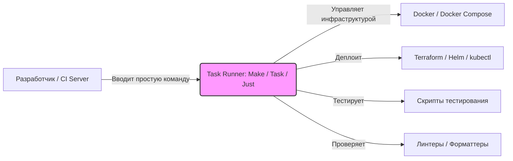

# Утилиты сборки (Make, Taskfile, Just)

## 📖 DevOps-история: Боль и Решение
**Боль:** Новый разработчик приходит в команду, открывает огромный `README.md` и видит 15 различных bash-скриптов для настройки локального окружения (поднять базу, накатить миграции, запустить моки, собрать фронт). Команды забываются, скрипты теряются в недрах репозитория, а классический `Makefile` бесит синтаксисом (обязательные табуляции вместо пробелов, `.PHONY`).
**Решение:** Внедрение современных task runners (инструментов запуска задач), таких как **Taskfile** (основан на YAML) или **Just** (написан на Rust, улучшенный Make), которые служат единой, понятной точкой входа. Разработчику достаточно набрать `task up` или `just deploy`, а инструмент сам разрулит зависимости и выполнит нужные шаги.

## 🏗 Архитектура: Единая точка входа


## 💻 Примеры

### 1. Старый добрый Make (`Makefile`)
Самый распространенный, но капризный вариант.
```makefile
.PHONY: build deploy help
.DEFAULT_GOAL := help

help: ## Показать это меню самодокументации
	@grep -E '^[a-zA-Z_-]+:.*?## .*$$' $(MAKEFILE_LIST) | awk 'BEGIN {FS = ":.*?## "}; {printf "\033[36m%-15s\033[0m %s\n", $$1, $$2}'

build: ## Собрать докер образ (ВНИМАНИЕ: отступы должны быть табами, а не пробелами!)
	docker build -t my-app .

deploy: build ## Задеплоить в k8s (шаг зависит от build)
	kubectl apply -f k8s/
```

### 2. Task (`Taskfile.yml`) — современный и понятный
Написан на Go, использует YAML, отлично работает кроссплатформенно.
```yaml
version: '3'

tasks:
  build:
    desc: "Собрать Docker-образ"
    cmds:
      - docker build -t my-app .
    
  deploy:
    desc: "Задеплоить приложение"
    deps: [build] # Зависимость, build выполнится первым
    cmds:
      - kubectl apply -f k8s/
```

### 3. Just (`Justfile`) — Makefile здорового человека
Сохраняет дух Makefile, но исправляет его главные недостатки.
```justfile
# Вызов `just` без аргументов покажет список команд
@default:
    just --list

# Собрать Docker-образ
build:
    docker build -t my-app .

# Задеплоить приложение (зависит от build)
deploy: build
    kubectl apply -f k8s/
```

## 🛠 Day 2 Operations
- **Самодокументация:** Всегда используйте встроенные механизмы описания задач (`desc:` в Task, комментарии в Just/Make). Команда `task --list` или `just --list` должна стать полноценной заменой вашему гайду по локальному запуску в `README.md`.
- **Интеграция с CI/CD:** Вызывайте те же самые таски в CI-пайплайнах (например, `task lint` или `task test`), вместо написания raw bash. Это гарантирует, что локальный запуск и сборка на сервере идентичны.
- **Управление окружением:** Используйте встроенные функции загрузки `.env` файлов (например, блок `dotenv: ['.env']` в Task), чтобы легко прокидывать локальные секреты и конфигурации без дополнительных bash-оберток.

## 🚫 Антипаттерны
1. **Превращение раннера в спагетти-код.** Если блок команд в таске становится длиннее 10-15 строк или обрастает сложными if/else, немедленно вынесите его в отдельный bash/python скрипт и просто вызывайте скрипт из раннера.
2. **Host Dependencies (Локальные зависимости).** Команда `task build` не должна ломаться только потому, что у разработчика не установлена нужная версия `node` или `go`. Оборачивайте команды в Docker (например, `docker run --rm -v $(pwd):/app ...`), чтобы все работало везде.
3. **Хардкод секретов.** Никогда не пишите пароли и токены прямо в `Taskfile`/`Makefile`. Интегрируйте их через переменные окружения и утилиты вроде 1Password CLI или SOPS.
