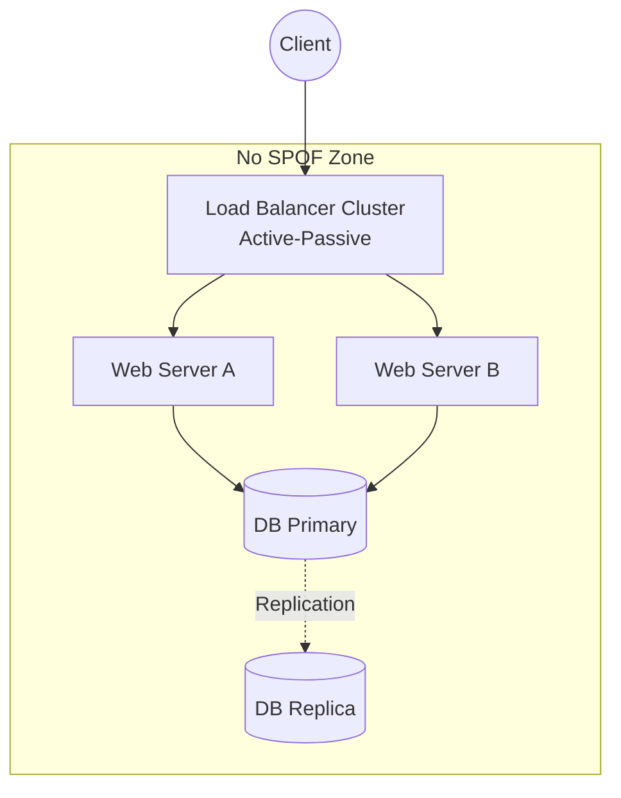

# Основы надежности (HA, Fault Tolerance, Resilience, SPOF)

## DevOps-история (Боль и решение)
**Боль:** Сервер базы данных упал в "черную пятницу". Приложение полностью легло, потому что к базе не было запасных путей, а балансировщик нагрузки крутился на одной виртуалке (SPOF - Single Point of Failure).
**Решение:** Внедрение High Availability (HA) через кластеризацию БД и настройка Fault Tolerance с помощью отказоустойчивых балансировщиков. Приложение стало Resilient, научившись делать graceful degradation и ретраи при кратковременных сбоях сети.

## Архитектура (Mermaid-схема)


## Примеры (YAML/Bash/Code)
Пример настройки Resilience (Retry pattern) в Kubernetes с помощью Istio:
```yaml
apiVersion: networking.istio.io/v1alpha3
kind: VirtualService
metadata:
  name: my-service
spec:
  hosts:
  - my-service
  http:
  - route:
    - destination:
        host: my-service
    retries:
      attempts: 3
      perTryTimeout: 2s
      retryOn: connect-failure,5xx
```

## Day 2 Operations
- **Chaos Engineering:** Регулярно "убивайте" инстансы (например, с помощью Chaos Monkey), чтобы проверять, как система переносит сбои в реальной жизни.
- **Мониторинг ресурсов:** Настройте алерты на рассинхронизацию репликации баз данных и исчерпание пула коннектов — это частые предвестники каскадных сбоев.
- **Тестирование HA:** Проводите плановые учения по переключению (failover) балансировщиков и баз данных в рабочее время, пока команда на месте.

## Антипаттерны
- **Узел-одиночка (SPOF):** Оставлять критичный компонент (например, DNS или API Gateway) без резервирования.
- **Бесконечные ретраи:** Отсутствие Circuit Breaker при ретраях, что приводит к "шторму ретраев" (retry storm) и окончательному падению перегруженного зависимого сервиса.
- **Фейковый HA:** Размещение всех реплик или нод кластера в одной стойке (rack) или одной зоне доступности (AZ).
