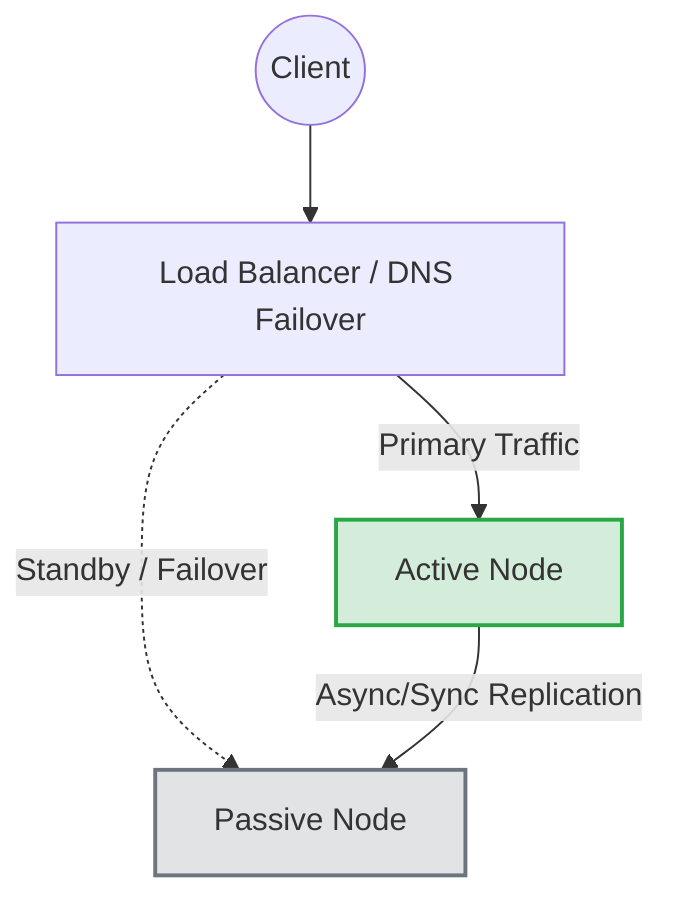
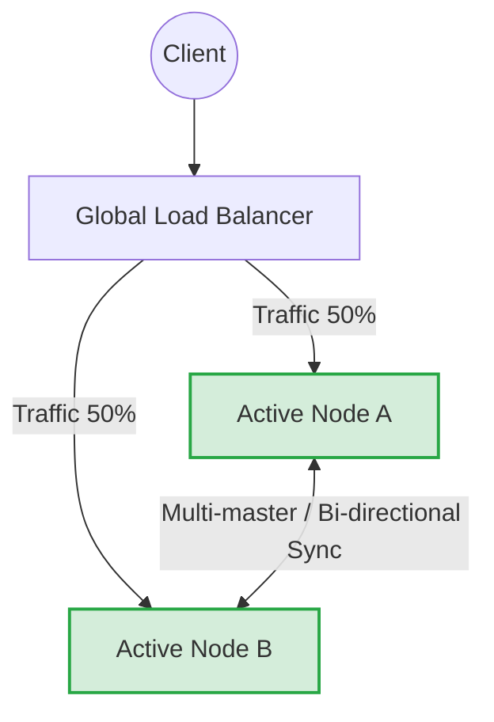

# Active-Active vs Active-Passive

## 📖 DevOps-история: Боль и Решение
**Боль:** Сервер базы данных упал. У нас есть резервный (Passive), но на его запуск, прогрев кэшей, смену DNS и проверку консистентности уходит 30 минут. Время простоя слишком велико, SLA нарушен. С другой стороны, попытка сделать всё Active-Active привела к конфликтам записи (split-brain) и потере данных пользователей.
**Решение:** Четкое понимание бизнес-требований к RTO (Recovery Time Objective) и RPO (Recovery Point Objective) для выбора правильной стратегии балансировки и репликации: Active-Passive (дешевле, проще, но есть время простоя) или Active-Active (дорого, сложно, без простоев).

## 📊 Архитектура (Mermaid)

### Active-Passive


### Active-Active


## 🛠 Пример: Nginx Active-Passive Load Balancing
```nginx
upstream backend {
    # Active node
    server 10.0.0.1:8080 max_fails=3 fail_timeout=30s;
    
    # Passive node (backup)
    server 10.0.0.2:8080 backup;
}

server {
    listen 80;
    location / {
        proxy_pass http://backend;
    }
}
```

## 🌅 Day 2 Operations
- **Тестирование Failover (для Active-Passive):** Регулярно переключайте роли узлов (сделайте Passive активным). Если резервный узел простаивает месяцами, велика вероятность, что при реальной аварии он не запустится из-за рассинхронизации конфигов или версий ПО.
- **Мониторинг Split-Brain (для Active-Active):** Настройте строгие алерты на сетевые разделения между дата-центрами. Используйте системы кворума (например, 3 ноды: 2 с данными + 1 арбитр), чтобы избежать независимой записи в обе стороны при обрыве связи.
- **Управление кэшем:** В Active-Passive при переключении кэш будет "холодным", что вызовет лавину запросов к БД (Thundering Herd). Предусмотрите постепенный прогрев.

## 🚫 Антипаттерны
- **Active-Active для сложных транзакционных БД без нужды:** Пытаться настроить Multi-Master MySQL/PostgreSQL кластер между регионами для обычного блога. Это приведет к огромным накладным расходам и боли разрешения конфликтов. Часто достаточно Read-Replica (Active-Passive для записи).
- **Отсутствие автоматики в Active-Passive:** Надежда на то, что человек успеет среагировать и руками перевести трафик на Passive-узел быстрее, чем пользователи заметят ошибку.
- **Игнорирование state (состояния) в Active-Active:** Маршрутизация пользователя на разные узлы в рамках одной сессии, если сессии не хранятся в общем хранилище (например, Redis).
