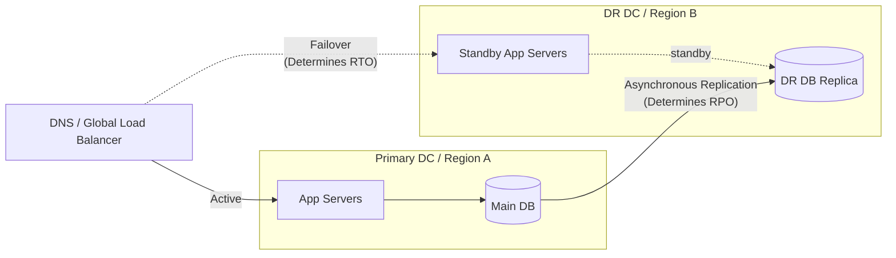

# Disaster Recovery (DR) и Business Continuity (BC)

## DevOps-история (Боль и решение)
**Боль:** Пожар в локальном дата-центре уничтожил стойки с серверами. Бэкапы хранились на соседней полке в том же здании. Бизнес встал на несколько дней, компания понесла огромные убытки.
**Решение:** Разработка Business Continuity Plan (BCP) и реализация Disaster Recovery (DR) стратегии. Бэкапы стали регулярно отправляться в другой географический регион (offsite), а критичные сервисы получили резервный контур в облаке с четко заданными RTO (Recovery Time Objective) и RPO (Recovery Point Objective).

## Архитектура (Mermaid-схема)


## Примеры (YAML/Bash/Code)
Bash-скрипт для создания offsite-бэкапа базы данных в AWS S3 (уменьшение RPO):
```bash
#!/bin/bash
set -e

BACKUP_NAME="db_backup_$(date +%Y%m%d_%H%M%S).sql.gz"
S3_BUCKET="s3://my-dr-backups/postgres/"

# Создание дампа и архивация
pg_dump -U $DB_USER -h $DB_HOST $DB_NAME | gzip > /tmp/$BACKUP_NAME

# Отправка в DR регион (Offsite storage)
aws s3 cp /tmp/$BACKUP_NAME $S3_BUCKET$BACKUP_NAME --region us-east-1

# Очистка локальной копии
rm /tmp/$BACKUP_NAME
echo "Backup sent to DR site successfully."
```

## Day 2 Operations
- **Регулярные учения (DR Drills):** Раз в квартал или полгода проводите тестовое переключение трафика на DR-площадку. Непроверенный бэкап — это отсутствие бэкапа.
- **Автоматизация Failover:** Максимально автоматизируйте процесс переключения DNS и "промоут" (promote) базы данных до мастера, чтобы минимизировать RTO.
- **Актуализация BCP:** Регулярно обновляйте документацию по аварийному восстановлению, так как инфраструктура и зависимости сервисов постоянно меняются.

## Антипаттерны
- **Хранение бэкапов рядом с данными:** Хранить резервные копии на том же диске, сервере или в том же дата-центре, что и оригинальные данные.
- **Отсутствие метрик RTO/RPO:** Делать бэкапы "когда получится", без понимания того, сколько данных бизнес готов потерять (RPO) и как долго может простаивать (RTO).
- **Ручное восстановление инфраструктуры:** Рассчитывать на ручные скрипты и длинные текстовые инструкции по восстановлению вместо использования IaC (Terraform/Ansible) для автоматического поднятия DR-окружения.
