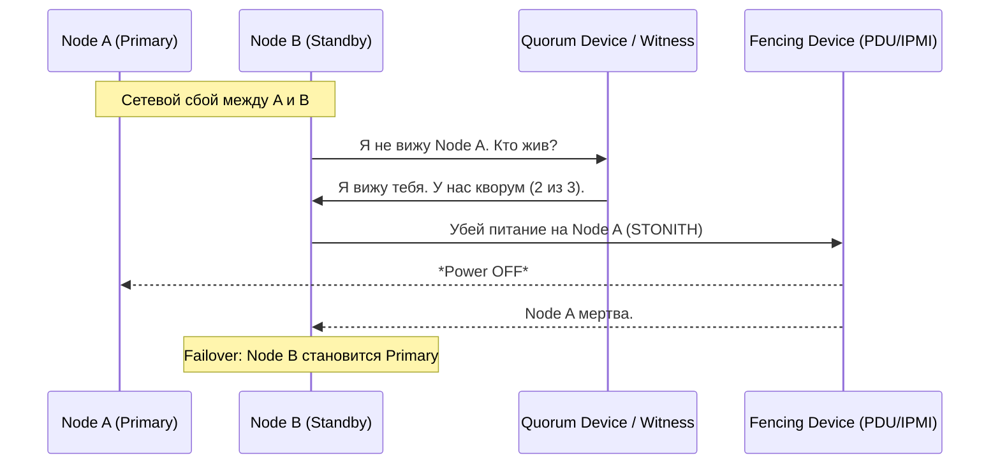

# Failover, Fencing и Quorum

## 📖 DevOps-история: Боль и Решение
**Боль:** В пятницу вечером произошел сетевой сбой (network partition) между двумя дата-центрами. Кластер базы данных распался на две части. Каждая часть решила, что другая умерла, и назначила себя Primary (Split-Brain). Обе ноды начали принимать запись. В понедельник сеть восстановилась, и мы получили неразрешимый конфликт данных, который пришлось разгребать вручную целую неделю.
**Решение:** Внедрение строгого **Кворума** (Quorum) для принятия решений и жесткого **Фенсинга** (Fencing/STONITH) для гарантированного отключения "зависших" узлов перед **Фейловером** (Failover).

## 📊 Архитектура и Принцип работы



## 💻 Примеры реализации

### Настройка Quorum (Corosync/Pacemaker)
```bash
# Проверка статуса кворума в кластере
corosync-quorumtool -s

# Ожидаемый вывод:
# Quorum information
# ------------------
# Date:             Fri Jul 25 20:20:00 2026
# Quorum provider:  corosync_votequorum
# Nodes:            3
# Node ID:          1
# Ring ID:          1/10
# Quorate:          Yes
```

### Пример конфигурации Fencing (STONITH) для IPMI
```bash
# Добавление fencing устройства в Pacemaker
pcs stonith create ipmi-fencing fence_ipmilan \
    pcmk_host_list="node1 node2" \
    ipaddr="192.168.1.100" \
    login="admin" \
    passwd="secretpassword" \
    lanplus=1 \
    op monitor interval=60s
```

## 🛠 Day 2 Operations (Эксплуатация)
1. **Регулярные учения (Disaster Recovery Drills):** Раз в квартал намеренно "рубите" сеть или питание мастер-ноде в production-подобной среде.
2. **Мониторинг Fencing-устройств:** IPMI/PDU интерфейсы часто зависают. Настройте алерты на недоступность самих устройств фенсинга, иначе в час Х STONITH не сработает.
3. **Резервирование сети:** Используйте как минимум два независимых сетевых интерфейса для heartbeat-трафика (Corosync/Keepalived).

## ⚠️ Антипаттерны
- **Кластер из 2-х узлов без свидетеля (Witness):** Невозможно собрать кворум при разрыве связи. Всегда используйте нечетное количество голосов (3, 5).
- **Мягкий Fencing (только по сети):** Попытка просто "попросить" ноду выключить сервис. Если сервер завис на уровне ядра, он не ответит. Используйте STONITH (Shoot The Other Node In The Head) — физическое отключение питания.
- **Ручной Failover в критичных системах:** Ожидание админа ночью для переключения базы приводит к недопустимому простою (RTO). Процесс должен быть автоматизирован с защитой от ложных срабатываний.
