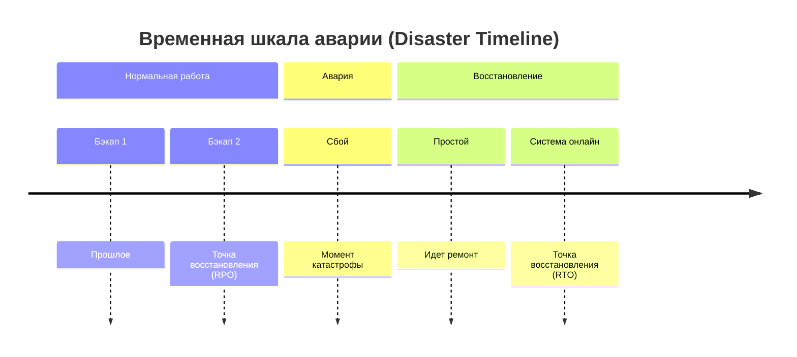

# RPO и RTO: Метрики аварийного восстановления

## 📖 История из жизни (Боль и Решение)
**Боль:** Сервер БД упал. Мы гордо восстановили его из бэкапа, который делался каждую полночь. Проблема? Упал он в 23:00, и мы потеряли целый день транзакций. А само восстановление заняло 8 часов, потому что бэкапы лежали в медленном холодном хранилище. Бизнес был в ярости.
**Решение:** Мы ввели метрики RPO (Recovery Point Objective) и RTO (Recovery Time Objective). Выяснили, что для этой БД RPO должно быть 15 минут, а RTO — 1 час. Настроили потоковую репликацию (для RPO) и автоматизировали процесс failover'а (для RTO).

## 📊 Архитектура / Схема (Mermaid)

*Более детальная схема:*


## 💻 Примеры кода

**Мониторинг RPO (Prometheus Alert для репликации Postgres):**
```yaml
groups:
- name: replication_alerts
  rules:
  - alert: HighReplicationLag
    expr: pg_stat_replication_reply_time_seconds > 900 # 15 минут
    for: 5m
    labels:
      severity: critical
    annotations:
      summary: "Нарушение RPO! Отставание реплики более 15 минут"
      description: "Текущее отставание: {{ $value }} секунд. В случае аварии мы потеряем больше данных, чем допустимо по RPO."
```

## 🛠 Day 2 Operations (Советы)
1. **Регулярные учения (Disaster Recovery Drills):** Недостаточно просто написать цифры в документах. Раз в квартал имитируйте сбой и замеряйте *реальный* RTO.
2. **Многоуровневость:** Не всем системам нужен RPO=0. Разделите сервисы на Tier 1 (критичные, RPO/RTO минуты), Tier 2 (часы) и Tier 3 (дни), чтобы не тратить бюджет впустую.
3. **Автоматизация измерений:** RPO можно измерять постоянно (например, по лагу репликации). RTO измеряется во время тестов. 

## ⚠️ Антипаттерны
- **Ожидание RPO=0 и RTO=0 без бюджета:** Это требует Active-Active архитектуры в разных ЦОД, что стоит космических денег.
- **Определение метрик инженерами:** RPO и RTO должен задавать *бизнес* на основе стоимости простоя и потери данных, а не DevOps.
- **Игнорирование времени на DNS и прогрев кешей:** Успешный старт контейнера — это еще не RTO. RTO достигается, когда система готова обслуживать клиентский трафик.
