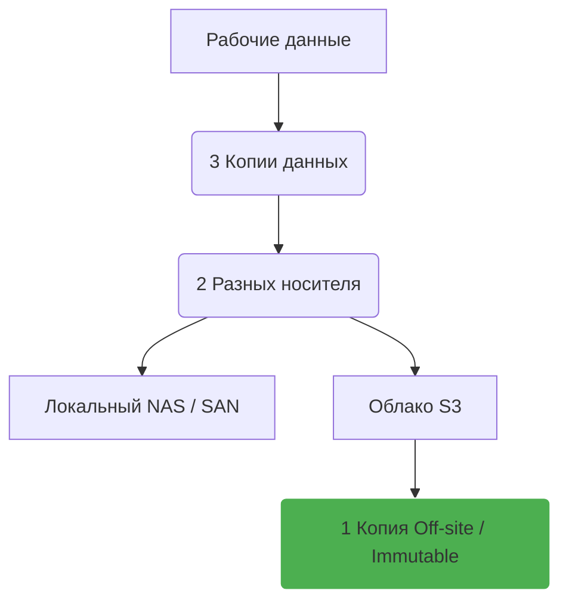
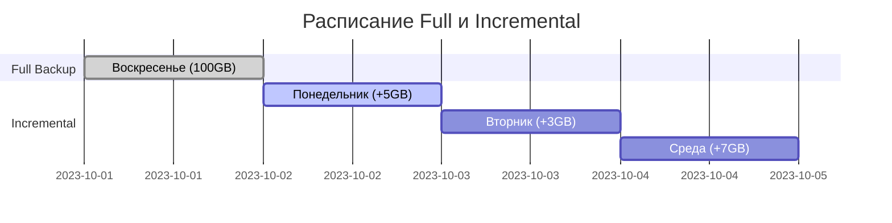

# Стратегии Backup и Restore (Типы, Верификация)

## 📖 История из жизни (Боль и Решение)
**Боль:** Мы делали бэкапы базы данных каждую ночь и складировали их в S3. Все скрипты отрабатывали без ошибок (зеленые галочки в CI/CD). Когда случился инцидент и нам потребовалось восстановиться, выяснилось, что последние 3 месяца скрипт дампил *пустую* базу из-за ошибки в переменных окружения.
**Решение:** Перешли от парадигмы "мы делаем бэкапы" к "мы гарантируем восстановление". Внедрили правило 3-2-1 и автоматизировали процесс верификации бэкапов: тестовый инстанс теперь каждую ночь разворачивается из свежего дампа и прогоняет smoke-тесты.

## 📊 Архитектура / Схема (Mermaid)

### Правило 3-2-1


### Типы бэкапов


## 💻 Примеры кода

**Автоматический бэкап Kubernetes кластера с помощью Velero:**
```yaml
apiVersion: velero.io/v1
kind: Schedule
metadata:
  name: daily-cluster-backup
  namespace: velero
spec:
  schedule: "0 2 * * *" # Каждый день в 2:00
  template:
    includedNamespaces:
    - default
    - production
    snapshotVolumes: true
    ttl: 720h0m0s # Хранить 30 дней
```

**Bash скрипт для базовой верификации бэкапа MySQL:**
```bash
#!/bin/bash
# Загружаем бэкап
aws s3 cp s3://my-backups/db/latest.sql.gz /tmp/latest.sql.gz
gunzip /tmp/latest.sql.gz

# Поднимаем временную БД в Docker
docker run --name verify-db -e MYSQL_ROOT_PASSWORD=test -d mysql:8.0
sleep 15

# Накатываем дамп
docker exec -i verify-db mysql -uroot -ptest < /tmp/latest.sql
if [ $? -eq 0 ]; then
  echo "✅ Restore successful!"
  # Здесь можно запустить SQL-запрос для проверки целостности
else
  echo "❌ Restore failed!"
  exit 1
fi
docker rm -f verify-db
```

## 🛠 Day 2 Operations (Советы)
1. **Автоматическая верификация:** Бэкап Шредингера мертв, пока вы из него не восстановились. Настройте pipeline, который берет бэкап, разворачивает его и прогоняет базовые запросы.
2. **Immutable Backups:** Защита от Ransomware. Используйте S3 Object Lock, чтобы даже скомпрометированные креды AWS не позволили удалить резервные копии.
3. **Мониторинг Restore-процесса:** Знайте, сколько времени занимает развертывание 100GB дампа, чтобы ваш RTO был реалистичным.

## ⚠️ Антипаттерны
- **Хранение бэкапов на том же диске/сервере:** Смерть диска уносит и данные, и бэкапы.
- **Отсутствие документации по восстановлению:** Во время инцидента люди паникуют. Процесс "как восстановить" должен быть пошаговым чек-листом (Runbook), а не знаниями в голове сеньора.
- **Слепая вера в снапшоты:** Снапшот диска (EBS/VMware) — это не всегда консистентный бэкап БД, если не был выполнен flush транзакций (quiescing).
