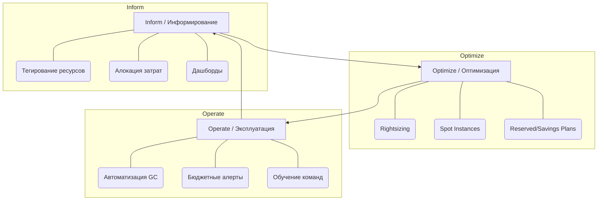

# Основы FinOps и Cloud Cost Management

## 📖 DevOps-история: Боль и Решение
**Боль:** После миграции в облако мы радовались скорости доставки фич. Но через полгода пришел счет на $50,000 вместо ожидаемых $10,000. Оказалось, разработчики оставляли включенными огромные GPU-инстансы для тестов на выходные, а терабайты "сиротских" (unattached) дисков лежали мертвым грузом.
**Решение:** Внедрение культуры **FinOps**. Настроили жесткое тегирование всех ресурсов, создали дашборды стоимости для каждой команды, настроили автоматическое удаление неиспользуемых ресурсов (Garbage Collection) и перешли на Spot-инстансы для dev-сред.

## 📊 Жизненный цикл FinOps



## 💻 Примеры реализации

### Поиск "сиротских" дисков (AWS)
Bash-скрипт для поиска EBS томов, которые ни к чему не подключены:
```bash
#!/bin/bash
# Найти все available (неподключенные) EBS тома
aws ec2 describe-volumes \
    --filters Name=status,Values=available \
    --query 'Volumes[*].{ID:VolumeId,Size:Size,Type:VolumeType}' \
    --output table
```

### Настройка бюджетного алерта (Terraform)
```hcl
resource "aws_budgets_budget" "dev_team_budget" {
  name              = "dev-team-monthly-budget"
  budget_type       = "COST"
  limit_amount      = "1000"
  limit_unit        = "USD"
  time_unit         = "MONTHLY"

  notification {
    comparison_operator        = "GREATER_THAN"
    threshold                  = 80
    threshold_type             = "PERCENTAGE"
    notification_type          = "ACTUAL"
    subscriber_email_addresses = ["dev-leads@example.com", "finops@example.com"]
  }
}
```

## 🛠 Day 2 Operations (Эксплуатация)
1. **Showback вместо Chargeback (на старте):** Не заставляйте команды сразу платить из своего бюджета. Сначала просто показывайте им, сколько они тратят (Showback), чтобы воспитать осознанность.
2. **Gamification:** Устройте соревнование между командами: кто больше сэкономит без ущерба для производительности (например, оптимизирует запросы к БД или настроит автоскейлинг).
3. **Автоматический сон:** Настройте скрипты (например, AWS Instance Scheduler или KEDA в Kubernetes), которые гасят dev/test окружения на ночь и выходные.

## ⚠️ Антипаттерны
- **Lift and Shift без адаптации:** Перенос on-premise архитектуры 1-в-1 в облако без использования управляемых сервисов (PaaS/SaaS) и автоскейлинга. Это всегда дороже.
- **Отсутствие тегов:** Невозможность понять, какому продукту/команде принадлежит ресурс. Правило: ресурс без тега `Owner` и `Environment` должен автоматически удаляться через 24 часа.
- **Оптимизация только силами DevOps:** FinOps — это не задача одних админов. Если разработчики не понимают, как их код влияет на стоимость инфраструктуры, затраты будут расти.
