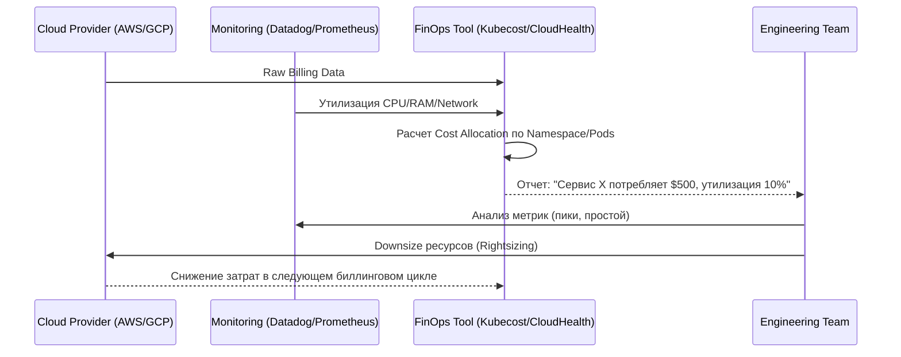

# Cost Allocation и Rightsizing

## 📖 История: Боль и Решение
**Боль:** Компания платит десятки тысяч долларов за облако, но инстансы загружены на 5%, диски простаивают, а старые снапшоты копятся годами. При этом непонятно, какой микросервис или клиент обходится дороже всего, потому что все крутится в одном большом EKS-кластере без разделения затрат.
**Решение:** Внедрение Cost Allocation (аллокация/распределение затрат) для понимания Unit Economics и регулярный Rightsizing (подбор оптимальных размеров) ресурсов для отрезания "жирка".

## 📊 Архитектура и Процесс (Mermaid)



## 💻 Примеры

### Rightsizing: Поиск простаивающих EBS томов (Bash / AWS CLI)
Скрипт для поиска "сиротских" дисков, которые не прикреплены к инстансам, за которые мы платим.

```bash
#!/bin/bash
echo "Finding unattached EBS volumes..."
aws ec2 describe-volumes \
    --filters Name=status,Values=available \
    --query 'Volumes[*].{ID:VolumeId,Size:Size,Type:VolumeType,Cost:Size}' \
    --output table
# После анализа их можно удалить для экономии.
```

### Cost Allocation в Kubernetes с помощью Kubecost
Чтобы понимать, сколько стоит конкретный Namespace или Deployment в K8s, нужен инструмент типа Kubecost. Пример запроса к API Kubecost для получения аллокации по namespace за последние 7 дней:

```bash
curl -G "http://localhost:9090/model/allocation" \
    -d window=7d \
    -d aggregate=namespace \
    -d accumulate=true
```

### Terraform Rightsizing (Переход на Graviton / ARM)
Смена архитектуры процессора — отличный пример Rightsizing'а, дающий лучшее соотношение цена/производительность.

```hcl
resource "aws_db_instance" "postgres" {
  identifier           = "prod-db"
  # Было: instance_class = "db.m5.large" (x86)
  # Стало: переход на ARM (Graviton), дешевле и быстрее
  instance_class       = "db.m6g.large" 
  allocated_storage    = 100
  engine               = "postgres"
  engine_version       = "13.4"
  # ...
}
```

## ⚙️ Day 2 Operations
- **Showback / Chargeback:** Внедрите Showback (показывать командам их траты), прежде чем переходить к Chargeback (реальное списание бюджетов с подразделений).
- **Автоматизация очистки:** Настройте скрипты (например, AWS Nuke или AWS Lambda) для автоматического удаления старых снапшотов баз данных, неиспользуемых IP-адресов и отключенных дисков.
- **Spot Instances:** Интегрируйте использование Spot-инстансов для stateless workload (воркеры, CI-раннеры) через Karpenter или ASG.
- **Метрики утилизации:** Rightsizing невозможен без точных метрик памяти и CPU (по P95-P99 перцентилям, а не только средним значениям).

## 🚫 Антипаттерны
- **Blind Downsizing:** Уменьшать ресурсы только на основе средних значений CPU. Можно нарваться на OOM-kill (Out Of Memory) в пиковые часы.
- **Единый большой кластер без лимитов:** Запускать все приложения в одном кластере K8s без Resource Requests/Limits. В итоге "сосед-шумовик" (noisy neighbor) съест все ресурсы.
- **Удаление без бэкапа:** При Rightsizing (удалении "ненужных" дисков или машин) не делать финальный снапшот/бекап на всякий случай.
- **Игнорирование сети:** Оптимизировать только Compute, забывая, что NAT Gateway и Data Transfer между зонами доступности (AZ) могут составлять до 30% счета.
