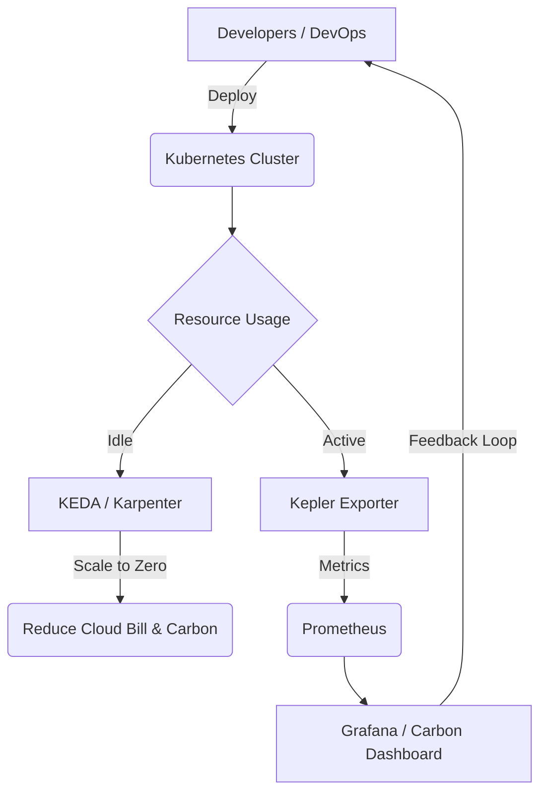

# GreenOps и Sustainability

## 📖 DevOps-история: Боль и Решение
**Боль:**
Компания мигрировала в облако (Lift and Shift), перенеся сотни "толстых" виртуалок. Счета за инфраструктуру выросли в 3 раза, а большая часть ресурсов простаивала ночью и в выходные. К тому же, инвесторы начали требовать отчеты по ESG (Environmental, Social, and Governance), а метрик по углеродному следу инфраструктуры (Carbon Footprint) не было.

**Решение (GreenOps):**
Внедрение культуры ресурсоэффективности. Мы интегрировали Kepler (Kubernetes-based Efficient Power Level Exporter) для оценки энергопотребления, настроили автоматическое масштабирование до нуля (KEDA) для тестовых окружений и перевели фоновые джобы на spot-инстансы в регионах с большей долей возобновляемой энергии (renewable energy).

---

## 📊 Архитектура и Процесс (Mermaid)



---

## 💻 Примеры

### KEDA: Масштабирование тестового окружения до нуля вне рабочего времени
Используем Cron-триггер для выключения подов ночью.

```yaml
apiVersion: keda.sh/v1alpha1
kind: ScaledObject
metadata:
  name: dev-env-scaler
  namespace: development
spec:
  scaleTargetRef:
    name: my-heavy-backend
  minReplicaCount: 0
  maxReplicaCount: 5
  triggers:
  - type: cron
    metadata:
      timezone: Europe/Moscow
      start: "0 20 * * *"   # Scale down at 20:00
      end: "0 8 * * *"      # Scale up at 08:00
      desiredReplicas: "1"  # Only 1 during active hours if no other load
```

### Запрос Prometheus (Kepler) для оценки мощности
Оценка потребления CPU подами в ваттах:
```promql
sum by (pod) (rate(kepler_container_joules_total[5m]))
```

---

## 🛠 Day 2 Operations (Советы)
1. **Continuous Profiling:** Используйте инструменты вроде Parca или Pyroscope. Оптимизированный код потребляет меньше CPU и, как следствие, меньше энергии.
2. **Right-sizing:** Регулярно пересматривайте `requests` и `limits` в Kubernetes с помощью VPA (Vertical Pod Autoscaler) или Goldilocks.
3. **Region Selection:** Выбирайте облачные регионы (зоны доступности) с низким PUE (Power Usage Effectiveness) и высоким процентом возобновляемой энергии, если это не противоречит требованиям latency.

---

## ❌ Антипаттерны
- **24/7 Dev/Stage окружения:** Держать тестовые среды включенными ночью и в выходные.
- **Оверпровижининг "на всякий случай":** Завышенные лимиты без настройки автоматического масштабирования.
- **Токсичные метрики:** Оптимизация потребления только ради отчета без реального снижения затрат (Greenwashing).
