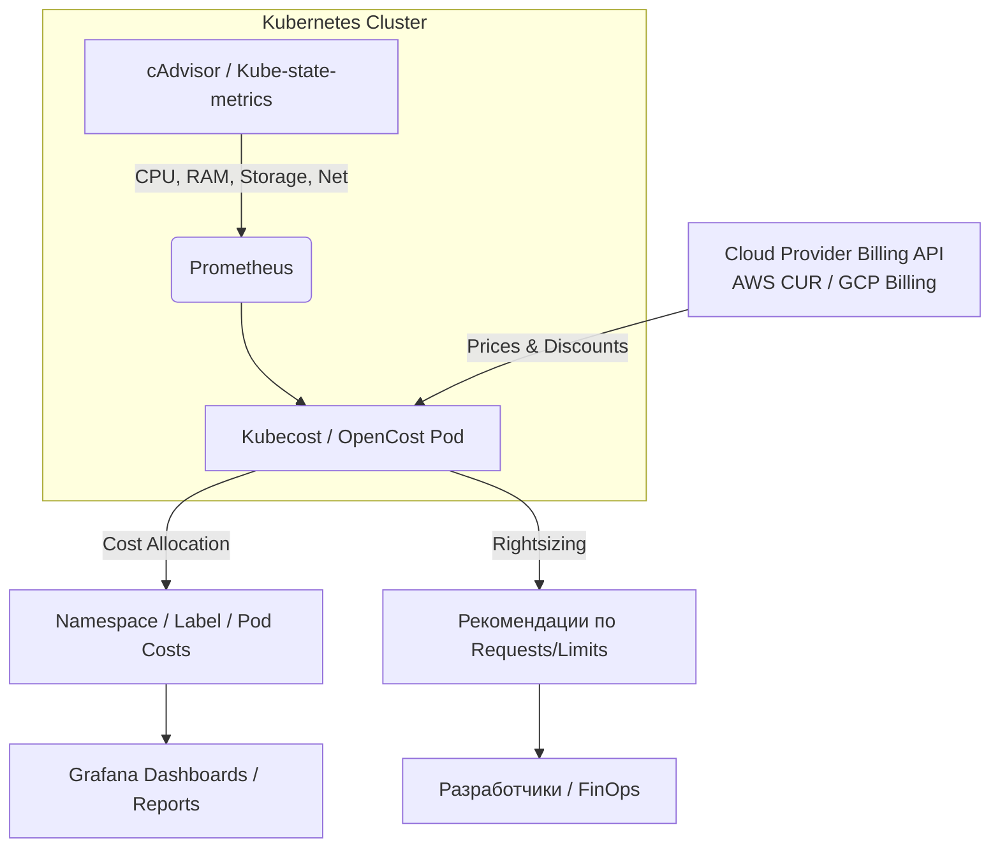

# Kubernetes Cost (Kubecost, OpenCost)

## 📖 DevOps-история (Боль и решение)

**Боль:** По мере роста Kubernetes-инфраструктуры, кластер превратился в «чёрную дыру» для бюджета. Разработчики запрашивали огромные лимиты ресурсов (requests/limits) "на всякий случай", а узлы простаивали с 20% утилизацией. Общий счет за AWS приходил единой суммой, и было невозможно понять, какая именно продуктовая команда тратит больше всего денег.

**Решение:** Внедрение **Kubecost** (или его open-source ядра **OpenCost**). Инструмент был установлен в кластер, интегрирован с Prometheus для сбора метрик и с Cloud Billing API провайдера (AWS/GCP) для получения точных цен. Теперь затраты аллоцируются по namespace, deployment и лейблам (например, `team=billing`). Разработчики получили доступ к дашбордам, а FinOps-команда внедрила процессы Showback (демонстрация расходов командам) и Chargeback (выставление счетов внутренним отделам).

## 📊 Архитектура аллокации затрат



## 💻 Примеры

### Пример 1: Установка OpenCost через Helm

```bash
helm repo add opencost https://opencost.github.io/opencost-helm-chart
helm repo update

helm install opencost opencost/opencost \
  --namespace opencost --create-namespace \
  --set opencost.exporter.defaultClusterId="prod-cluster-01" \
  --set opencost.prometheus.internal.enabled=true
```

### Пример 2: Лейблирование для корректной аллокации
Чтобы Kubecost мог правильно сгруппировать расходы по командам, обязательно стандартизируйте лейблы:

```yaml
apiVersion: apps/v1
kind: Deployment
metadata:
  name: billing-service
  namespace: prod-billing
  labels:
    app.kubernetes.io/name: billing-service
    team: finance-squad       # <- Лейбл для группировки костов
    cost-center: "10492"      # <- Привязка к бюджету компании
spec:
  # ...
```

## 🛠 Day 2 Operations (Советы по эксплуатации)

1. **Регулярный ревью Recommendations:** Kubecost анализирует реальное потребление и предлагает оптимальные Requests/Limits. Встройте этот отчет в еженедельные спринты команд (например, настройте отправку отчета в Slack).
2. **Интеграция с Автоскейлингом:** В связке с инструментами вроде Karpenter (AWS) или Cluster Autoscaler, правильные requests (настроенные на основе данных Kubecost) позволят кластеру быстрее и эффективнее сжиматься при падении нагрузки.
3. **Учет Out-of-Cluster костов:** Настройте Kubecost на интеграцию с облачными ресурсами (например, S3, RDS), чтобы видеть в едином окне, сколько стоит не только сам Deployment, но и используемая им база данных.
4. **Алертинг на аномалии:** Настройте оповещения на резкие скачки расходов в конкретном namespace, чтобы отлавливать ошибки в конфигурации до того, как придет счет за месяц.

## ⚠️ Антипаттерны

- ❌ **Внедрение инструмента без процессов:** Самая частая ошибка — поставить Kubecost и забыть. Если метрики никто не смотрит, а у команд нет мотивации снижать расходы (нет Showback/Chargeback), инструмент бесполезен.
- ❌ **Игнорирование сетевых расходов (Network Costs):** Часто забывают настроить и анализировать трафик между зонами доступности (Cross-AZ traffic). В K8s это может стоить огромных денег.
- ❌ **Слишком агрессивный Rightsizing:** Слепое применение рекомендаций Kubecost по снижению лимитов памяти может привести к OOMKilled (Out of Memory) подам. Всегда оставляйте буфер (margin) на пиковые нагрузки.
- ❌ **Отсутствие стандартизации тегов:** Если одна команда пишет `Team: Alpha`, другая `team: alpha`, а третья `owner: alpha`, вы не сможете собрать единый отчет по расходам.
