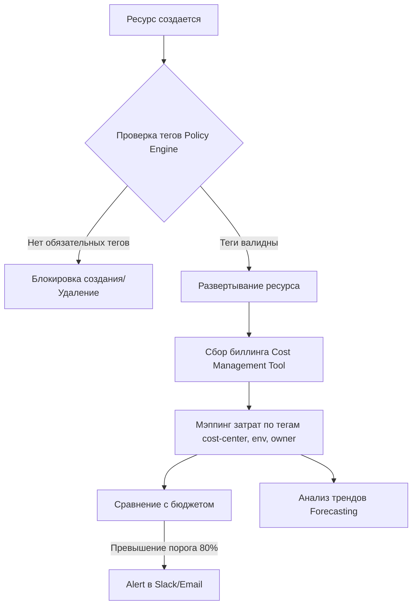

# Tagging Strategy, Budgeting, Forecasting

## 📖 История: Боль и Решение
**Боль:** В конце месяца пришел счет от облачного провайдера на сумму, втрое превышающую ожидания. Никто не понимает, чьи это ресурсы (dev, prod, тесты Васи?), какие проекты жрут бюджет, и как планировать траты на следующий квартал.
**Решение:** Внедрение строгой стратегии тегирования (Tagging Strategy) как Policy as Code, настройка алертов по бюджетам (Budgeting) и использование исторических данных для прогнозирования (Forecasting). Теперь каждый цент учтен.

## 📊 Архитектура и Процесс (Mermaid)



## 💻 Примеры

### Обязательные теги (AWS CloudFormation/Terraform)
В Terraform мы используем `default_tags` для провайдера:

```hcl
provider "aws" {
  region = "eu-west-1"
  default_tags {
    tags = {
      Environment = "production"
      Project     = "payment-gateway"
      Owner       = "dev-team-alpha"
      CostCenter  = "12345"
      ManagedBy   = "terraform"
    }
  }
}
```

### OPA/Rego Policy для проверки тегов
Пример политики, которая запрещает создание ресурсов без тега `Environment`:

```rego
package terraform.validation

deny[msg] {
    resource := input.resource_changes[_]
    resource.mode == "managed"
    tags := resource.change.after.tags
    not tags["Environment"]
    msg := sprintf("Resource %v is missing the mandatory 'Environment' tag", [resource.address])
}
```

### AWS Budgets Alert (YAML / CloudFormation)

```yaml
Resources:
  MonthlyBudget:
    Type: "AWS::Budgets::Budget"
    Properties:
      Budget:
        BudgetLimit:
          Amount: 1000
          Unit: USD
        BudgetType: COST
        TimeUnit: MONTHLY
      NotificationsWithSubscribers:
        - Notification:
            NotificationType: ACTUAL
            ComparisonOperator: GREATER_THAN
            Threshold: 80
          Subscribers:
            - SubscriptionType: EMAIL
              Address: "finops-alerts@company.com"
```

## ⚙️ Day 2 Operations
- **Регулярный аудит тегов:** Используйте скрипты (например, AWS Resource Groups Tagging API) для поиска Untagged-ресурсов раз в неделю.
- **Адаптация бюджетов:** Бюджеты должны быть "живыми". Пересматривайте их каждый квартал на основе Forecasting и планов роста.
- **Интеграция с CI/CD:** Проверяйте теги на этапе Pull Request (с помощью Infracost или OPA), а не после деплоя.
- **Отчетность:** Настройте дашборды (CloudCheckr, AWS Cost Explorer, Grafana), чтобы продуктовые команды видели свои затраты в реальном времени.

## 🚫 Антипаттерны
- **"Слишком много тегов":** Требовать от разработчиков заполнять 20 тегов для каждого микро-ресурса. Оставьте 3-5 обязательных (env, owner, service).
- **Ручное тегирование:** Позволять разработчикам ставить теги через UI консоли. Опечатки (`Env: Prod` vs `env: production`) сломают биллинг. Только IaC!
- **Реактивный мониторинг:** Смотреть на бюджеты только когда пришел счет. Бюджетные алерты должны срабатывать превентивно (например, при прогнозе превышения к концу месяца).
- **Отсутствие ответственных:** Когда уведомления о превышении бюджета сыпятся в общий канал Slack, на них никто не реагирует ("Эффект свидетеля").
