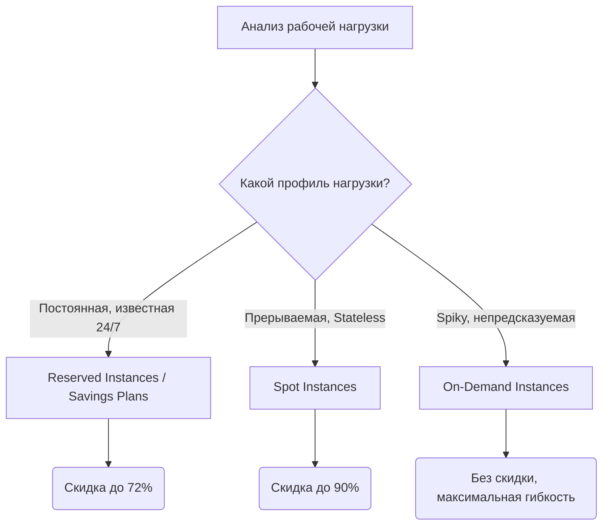

# Оптимизация (Reserved Instances, Savings Plans, Spot)

## 📖 DevOps-история (Боль и решение)

**Боль:** После успешной миграции в облако и запуска новой микросервисной архитектуры счета за AWS начали расти в геометрической прогрессии. Разработчики поднимали сотни контейнеров, и всё это работало на дорогих On-Demand инстансах. Бюджет на инфраструктуру иссяк за полгода.

**Решение:** Внедрение стратегии FinOps и эшелонированного подхода к вычислительным ресурсам. Базы данных и stateful-нагрузки были переведены на **Reserved Instances (RI)**, базовая (predictable) нагрузка кластеров — на **Savings Plans**, а все фоновые воркеры, CI/CD раннеры и batch-джобы — на дешевые **Spot-инстансы**. Результат: снижение расходов на 60% без потери производительности.

## 📊 Архитектура выбора ресурсов



## 💻 Примеры

### Пример 1: Настройка Spot-инстансов через Terraform (AWS ASG)
Использование Spot-инстансов с подстраховкой On-Demand.

```hcl
resource "aws_autoscaling_group" "spot_workers" {
  name                      = "worker-asg"
  max_size                  = 10
  min_size                  = 2
  desired_capacity          = 5
  vpc_zone_identifier       = module.vpc.private_subnets

  mixed_instances_policy {
    instances_distribution {
      on_demand_base_capacity                  = 1
      on_demand_percentage_above_base_capacity = 20
      spot_allocation_strategy                 = "capacity-optimized"
    }

    launch_template {
      launch_template_specification {
        launch_template_id = aws_launch_template.worker.id
        version            = "$Latest"
      }

      override {
        instance_type = "t3.medium"
      }
      override {
        instance_type = "t3a.medium"
      }
    }
  }
}
```

### Пример 2: Проверка экономии с помощью AWS CLI
Просмотр рекомендаций по Savings Plans:

```bash
aws ce get-savings-plans-purchase-recommendation \
    --savings-plans-type COMPUTE_SP \
    --term_in_years ONE_YEAR \
    --payment-option NO_UPFRONT \
    --lookback-period-in-days SEVEN_DAYS
```

## 🛠 Day 2 Operations (Советы по эксплуатации)

1. **Мониторинг Coverage и Utilization:** Регулярно отслеживайте метрики. *Coverage* (покрытие) показывает, какой процент ваших On-Demand ресурсов покрыт скидками, а *Utilization* (утилизация) — насколько эффективно вы используете купленные коммитменты. Цель: Utilization > 95%, Coverage ~ 70-80%.
2. **Alerting на Spot Interruptions:** Настройте обработку событий `Spot Instance Interruption Notice` (за 2 минуты до выключения) через EventBridge -> Lambda для graceful shutdown ваших приложений (корректное завершение соединений, drain подов в K8s).
3. **Diversification для Spot:** Всегда используйте несколько типов инстансов (instance families/sizes) и разные Availability Zones, чтобы минимизировать риск нехватки capacity.
4. **Регулярный ревью Savings Plans:** Нагрузка меняется. Проводите FinOps-встречи раз в месяц для анализа необходимости докупки SP.

## ⚠️ Антипаттерны

- ❌ **Покупка RI/SP "про запас" или без оптимизации прав (Rightsizing):** Покупка коммитментов на огромные неиспользуемые инстансы фиксирует ваши убытки на 1-3 года. Сначала урежьте ресурсы (rightsize), потом покупайте скидку.
- ❌ **Spot-инстансы для Stateful или критичных сервисов:** Размещение баз данных, ZooKeeper/etcd или критичных API на спотах приведёт к даунтаймам при изъятии ресурсов облаком.
- ❌ **Использование только одного типа инстанса для Spot:** Если в пуле закончится `t3.medium`, ваше приложение упадет. Нужно указывать `t3.medium`, `t3a.medium`, `m5.large` и т.д.
- ❌ **Забытые On-Demand среды:** Разворачивание тестовых, dev- и stage-стендов на On-Demand ресурсах 24/7 без автоматического выключения на ночь и выходные.
