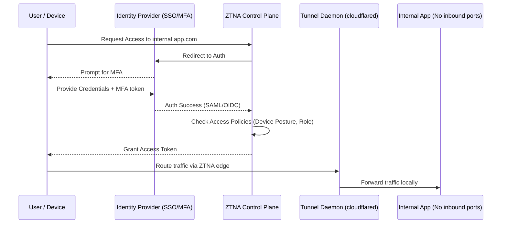

# Основы ZTNA и Tunnels

## 📖 DevOps-история: Боль и Решение
**Боль:**
Сотрудники работали на удаленке через классический VPN. VPN-сервер стал единой точкой отказа и "бутылочным горлышком" для трафика. Хуже того, компрометация одной учетной записи давала злоумышленнику доступ ко всей внутренней сети (Lateral Movement). Управлять правилами фаервола для сотен пользователей стало невозможно.

**Решение (ZTNA):**
Переход на концепцию Zero Trust Network Access. Мы отказались от VPN с доступом "на уровне сети" в пользу доступа "на уровне приложения". Интегрировали Identity Provider (IdP) с MFA, а сервисы спрятали за обратные туннели (Cloudflare Tunnels / Tailscale). Теперь каждый запрос авторизуется, а внутренние порты серверов вообще не смотрят в интернет.

---

## 📊 Архитектура и Процесс (Mermaid)



---

## 💻 Примеры

### Cloudflare Tunnel (cloudflared)
Внутренний сервис не требует публичного IP. Демон `cloudflared` устанавливает исходящее соединение с Edge-сетью.

```yaml
# config.yml
tunnel: <TUNNEL_UUID>
credentials-file: /etc/cloudflared/<TUNNEL_UUID>.json

ingress:
  # Доступ к админке только через политику аутентификации Cloudflare Access
  - hostname: admin.company.internal
    service: http://localhost:8080
  
  # SSH через браузер или `cloudflared access`
  - hostname: ssh.company.internal
    service: ssh://localhost:22

  # Catch-all правило
  - service: http_status:404
```

### Tailscale ACL (Управление доступом)
Простая политика контроля доступа в Tailscale (Identity-based routing).

```json
{
  "acls": [
    // DevOps имеют доступ ко всем серверам по SSH
    { "action": "accept", "src": ["group:devops"], "dst": ["tag:prod-servers:22"] },
    // Разработчики имеют доступ только к staging
    { "action": "accept", "src": ["group:developers"], "dst": ["tag:stage-servers:*"] }
  ],
  "groups": {
    "group:devops": ["alice@company.com", "bob@company.com"],
    "group:developers": ["charlie@company.com"]
  }
}
```

---

## 🛠 Day 2 Operations (Советы)
1. **Device Posture Checks:** Внедряйте проверки состояния устройств. Разрешайте доступ только с корпоративных ноутбуков, на которых запущен антивирус и установлены последние обновления ОС.
2. **Audit Logging:** Экспортируйте логи доступа (кто, когда и к какому приложению обращался) в SIEM. ZTNA дает гораздо больше контекста, чем логи сетевого фаервола.
3. **Continuous Verification:** Настройте короткое время жизни сессий (Session TTL) для критичных приложений, чтобы запрашивать переаутентификацию/MFA.

---

## ❌ Антипаттерны
- **"Мягкая сердцевина" (Soft Center):** Внедрить ZTNA для удаленщиков, но оставить модель "доверяй всем" внутри физического офиса.
- **Игнорирование MFA:** Развернуть ZTNA, но оставить вход только по логину и паролю.
- **Обходные пути (Bypass):** Оставлять старые VPN или открытые SSH-порты "на всякий случай" параллельно с работающим ZTNA.
