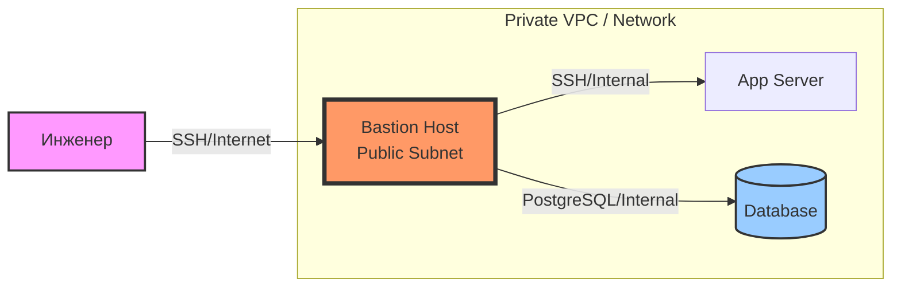

# Bastion Host и Jump Host

## История (Боль и Решение)
**Боль:** Базы данных, кэши, внутренние микросервисы и серверы приложений находятся в приватных подсетях без прямого доступа из интернета. Однако инженерам (DevOps, DBA, разработчикам) нужен доступ к ним для дебага, миграций и обслуживания.
**Решение:** **Bastion Host (Jump Host)** — сильно защищенный сервер, выставленный в публичную сеть (с белым IP), который служит единственной точкой входа (proxy) во внутреннюю инфраструктуру. Пользователь подключается по SSH к Бастиону, а уже с него — к внутренним серверам.

## Архитектура



## Примеры

### SSH ProxyJump (Прозрачное подключение)
Вместо того чтобы вручную заходить на бастион и оттуда писать `ssh target`, используйте файл `~/.ssh/config`:

```ssh-config
# ~/.ssh/config

# Настройки для бастиона
Host bastion
    HostName 203.0.113.10
    User ubuntu
    IdentityFile ~/.ssh/id_rsa_bastion

# Настройки для внутренних серверов
Host 10.0.*
    User appuser
    IdentityFile ~/.ssh/id_rsa_internal
    ProxyJump bastion
```
Использование: `ssh 10.0.1.5` — клиент сам установит туннель через бастион.

### Terraform (AWS Security Group)
Пример жестких правил сети: бастион доступен только с офисного IP, а внутренние серверы — только с бастиона.

```hcl
resource "aws_security_group" "bastion" {
  name = "bastion-sg"
  ingress {
    from_port   = 22
    to_port     = 22
    protocol    = "tcp"
    cidr_blocks = ["203.0.113.50/32"] # Только из офиса
  }
}

resource "aws_security_group" "private_instances" {
  name = "private-sg"
  ingress {
    from_port       = 22
    to_port         = 22
    protocol        = "tcp"
    security_groups = [aws_security_group.bastion.id] # Только от бастиона
  }
}
```

## Day 2 Operations (Советы)
1. **Эволюция ZTNA:** Сегодня классические бастионы с SSH-ключами устаревают. Используйте решения вроде **Teleport, Boundary или SSM (AWS Systems Manager)** — они предоставляют доступ по временным сертификатам, SSO и запись сессий.
2. **Аудит и Логирование:** Настройте отправку логов авторизации (`/var/log/auth.log`) на внешнюю систему (ELK, Datadog, CloudWatch) немедленно, так как бастион — первая цель атаки.
3. **Fail2Ban / Rate Limiting:** Обязательно защитите SSH на бастионе от брутфорса, поменяйте стандартный порт или используйте Port Knocking / VPN для сокрытия порта.

## Антипаттерны
- **Складирование ключей на бастионе:** Хранение приватных SSH-ключей (id_rsa) прямо на бастионе (ssh agent forwarding — более безопасная, но тоже рискованная альтернатива). Бастион должен только проксировать трафик.
- **Многофункциональный бастион:** Запуск на бастионе nginx, cron-джоб, баз данных или мониторинга. Бастион должен выполнять только одну функцию — проксирование доступа, чтобы минимизировать attack surface.
- **Долгий аптайм:** Бастионы не хранят состояние. Их нужно регулярно пересоздавать (Immutable Infrastructure) из обновленного образа ОС (AMI) со свежими патчами безопасности.
