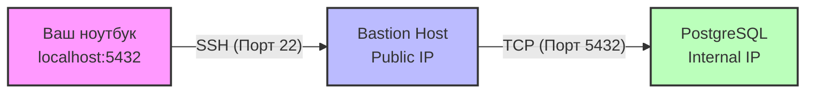

# SSH Tunneling и Port Forwarding

## 📖 История: От боли к решению

**Боль:** Вам нужно срочно подключиться к внутренней базе данных PostgreSQL, которая находится в закрытом контуре AWS. Поднимать полноценный VPN долго, сложно и избыточно для одной задачи.
**Решение:** Использовать SSH Port Forwarding через Bastion-хост, прокинув локальный порт прямо до базы данных.

## 🏗 Архитектура (Local Port Forwarding)



## 💻 Примеры

### 1. Local Port Forwarding (Проброс удаленного порта локально)
Пробрасываем порт 5432 с внутреннего сервера `db.internal` на наш `localhost:5432` через `bastion_host`.
```bash
ssh -L 5432:db.internal:5432 user@bastion_host
```
*Теперь можно подключаться к `localhost:5432` локально.*

### 2. Remote Port Forwarding (Проброс локального порта удаленно)
Делаем локальный веб-сервер (порт 8080) доступным на удаленном сервере (порт 9090).
```bash
ssh -R 9090:localhost:8080 user@remote_server
```

### 3. Dynamic Port Forwarding (SOCKS5 Proxy)
Создаем SOCKS-прокси на порту 1080 для маршрутизации всего браузерного трафика через сервер.
```bash
ssh -D 1080 user@proxy_server
```

### Автоматическое поддержание туннеля (AutoSSH)
```bash
autossh -M 0 -o "ServerAliveInterval 30" -o "ServerAliveCountMax 3" -N -L 8080:internal-app:80 user@bastion
```

## 🛠 Day 2 Operations (Советы по эксплуатации)
- **Используйте AutoSSH:** Для создания отказоустойчивых туннелей, которые сами переподключаются при обрыве связи (особенно полезно для IoT или нестабильных сетей).
- **Ограничение прав:** Создавайте специальных пользователей для туннелей без возможности открывать shell (`-N` и `ForceCommand /bin/false` в `sshd_config`).
- **Мониторинг:** Отслеживайте открытые туннели с помощью `netstat` или `ss -tulnp` и алертите на аномальное количество коннектов.
- **SSH Config:** Управляйте сложными туннелями через `~/.ssh/config` (используя директиву `LocalForward`), чтобы не писать длинные команды каждый раз.

## ⚠️ Антипаттерны
1. **Проброс на все интерфейсы без необходимости:** Использование флага `-g` или биндинг на `0.0.0.0` при локальном пробросе, что делает туннель доступным для всей вашей локальной сети.
2. **Вечные временные туннели:** Оставление "временных" туннелей, запущенных в `screen`/`tmux` навсегда. Это слепая зона безопасности.
3. **Использование root-доступа:** Поднятие туннелей из-под root-пользователя. Для проброса портов (выше 1024) root не нужен.
4. **Игнорирование ключей:** Использование парольной аутентификации вместо SSH-ключей (Ed25519) для автоматических туннелей.
