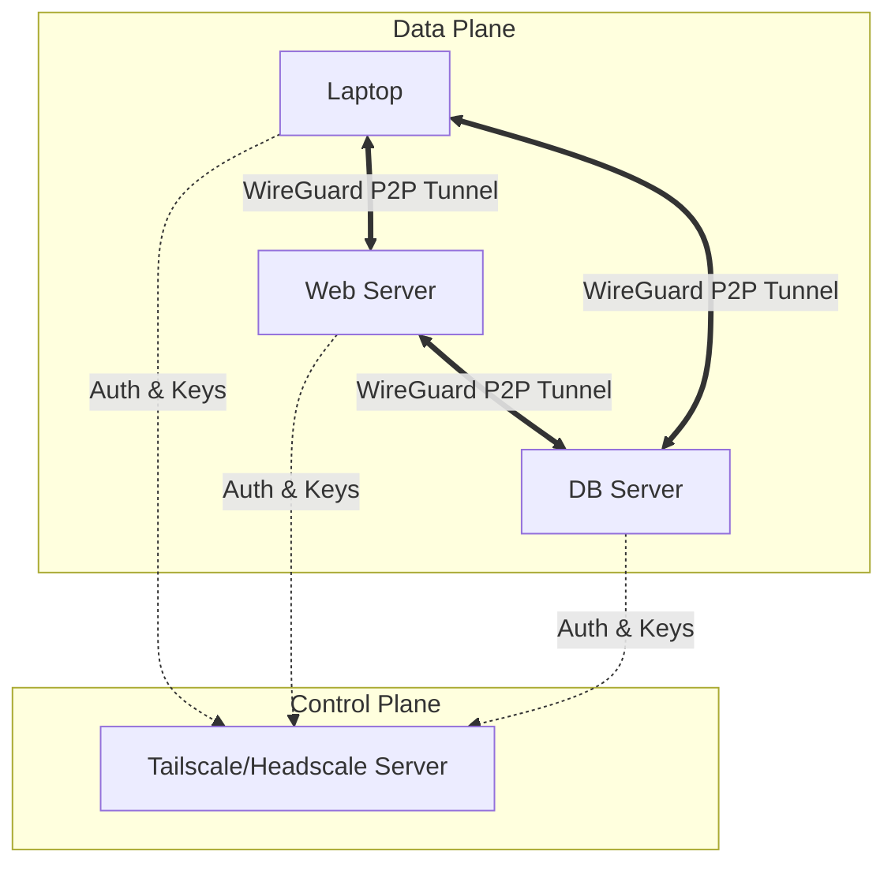

# Tailscale и Headscale

## История (Боль и Решение)
**Боль:** Классические VPN (OpenVPN, IPsec) требуют сложной настройки, выделенного сервера (hub), белых IP-адресов и открытых портов. Трафик идет через центральный узел (бутылочное горлышко), а управление ключами и отзывами доступов превращается в ад.
**Решение:** **Tailscale** — mesh-сеть поверх WireGuard с централизованным управлением доступом (SSO/IAM) и автоматической маршрутизацией (даже за NAT). Устройства общаются напрямую (peer-to-peer). **Headscale** — это open-source реализация control plane (координатора) для Tailscale, позволяющая не зависеть от SaaS-решения и хранить все на своих серверах.

## Архитектура



## Примеры

### Подключение узла
```bash
# Установка и запуск с использованием Headscale (кастомный control plane)
curl -fsSL https://tailscale.com/install.sh | sh
sudo tailscale up --login-server=https://headscale.example.com --accept-routes
```

### Настройка Subnet Router
Если нельзя поставить агента на все устройства (например, принтеры, RDS):
```bash
# Включаем форвардинг
echo 'net.ipv4.ip_forward = 1' | sudo tee -a /etc/sysctl.d/99-tailscale.conf
sudo sysctl -p /etc/sysctl.d/99-tailscale.conf

# Анонсируем подсеть
sudo tailscale up --advertise-routes=10.0.0.0/24
```

### Пример ACL (Tailscale HUJSON)
```json
{
  "acls": [
    // Админы имеют доступ ко всему
    {"action": "accept", "src": ["group:admins"], "dst": ["*:*"]},
    // Разработчики имеют доступ только к веб-серверам на порт 22 и 80
    {"action": "accept", "src": ["group:devs"], "dst": ["tag:webserver:22,80"]}
  ],
  "groups": {
    "group:admins": ["alice@example.com"],
    "group:devs": ["bob@example.com"]
  }
}
```

## Day 2 Operations (Советы)
1. **MagicDNS:** Используйте встроенный DNS Tailscale, чтобы обращаться к серверам по именам (например, `db-prod.tailnet`), а не по IP (100.x.x.x).
2. **Ephemeral Nodes:** Для CI/CD runners и эфемерных контейнеров используйте Auth Keys с тегом `ephemeral`, чтобы они автоматически удалялись из сети при выключении.
3. **Headscale Backup:** Регулярно бэкапьте SQLite/PostgreSQL базу Headscale — потеря ключей приведет к необходимости переподключения всей сети.

## Антипаттерны
- **Всё через Subnet Router:** Использование Tailscale только как точки входа в подсеть (hub-and-spoke) вместо установки агентов на каждый хост. Это лишает вас преимуществ mesh-маршрутизации и гранулярных ACL (Zero Trust).
- **Hardcoded Auth Keys везде:** Ручное копирование долгоживущих ключей авторизации вместо интеграции с OIDC/SSO (Tailscale) или Pre-Auth keys с ограниченным сроком действия.
- **Отсутствие тегов:** Привязка доступов в ACL к конкретным IP или пользователям вместо использования тегов (`tag:prod-db`).
