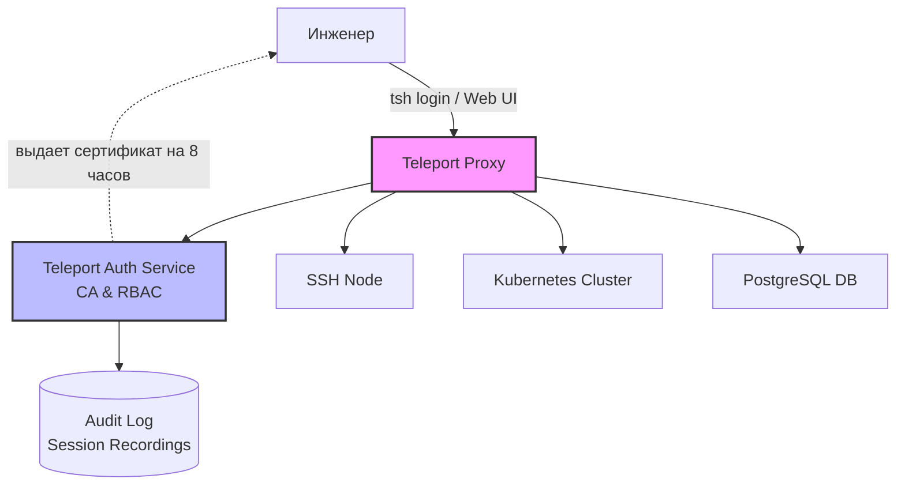

# Teleport (Identity-Aware Access)

## 📖 История: От боли к решению

**Боль:** У вас 100+ серверов, баз данных и Kubernetes-кластеров. Выдача доступов превратилась в хаос: SSH-ключи теряются, уволенные сотрудники оставляют бэкдоры, аудита действий (кто и что вводил в терминале) нет.
**Решение:** Внедрение **Teleport**. Вместо статических SSH-ключей используются короткоживущие сертификаты, привязанные к SSO (Identity), с полным аудитом сессий и гранулярным RBAC. Классический Zero Trust Network Access (ZTNA).

## 🏗 Архитектура



## 💻 Примеры

### 1. Подключение пользователя
Логин через IdP (например, Google Workspace или Okta) и подключение к серверу.
```bash
# Авторизация через браузер
tsh login --proxy=teleport.example.com --auth=okta

# Просмотр доступных ресурсов
tsh ls

# Подключение к серверу
tsh ssh root@app-server-01
```

### 2. Конфигурация Teleport Node (teleport.yaml)
Пример базовой настройки ноды, которая подключается к кластеру.
```yaml
teleport:
  nodename: app-server-01
  data_dir: /var/lib/teleport
  auth_token: "x-token-generated-from-auth-server"
  auth_servers:
    - teleport.example.com:443
ssh_service:
  enabled: "yes"
  labels:
    env: prod
    role: backend
```

### 3. Добавление новой ноды в кластер
```bash
# На Auth сервере генерируем токен (действует 1 час)
tctl tokens add --type=node --ttl=1h

# Вывод покажет команду для запуска на новом сервере, например:
# teleport start --roles=node --token=... --auth-server=...
```

## 🛠 Day 2 Operations (Советы по эксплуатации)
- **Интеграция с SIEM:** Экспортируйте аудит-логи Teleport (формат JSON) в ваш SIEM (Elasticsearch, Splunk, Datadog) для мониторинга аномальной активности.
- **Машинные пользователи (Machine ID):** Для CI/CD систем (Jenkins, GitLab CI) используйте Teleport Machine ID (tbot), чтобы избавиться от статических секретов в пайплайнах.
- **Автоматизация развертывания:** Используйте Terraform Provider для Teleport для управления ролями (RBAC) и инфраструктурой как кодом.
- **Session Recording:** Храните записи сессий в S3 бакетах с настроенным Lifecycle (например, удалять через 90 дней) для комплаенса.

## ⚠️ Антипаттерны
1. **Обход Teleport:** Оставление открытого порта 22 (sshd) на целевых серверах после внедрения Teleport. Порт 22 должен быть закрыт Firewall-ом или слушать только localhost, доступ должен идти только через Teleport Proxy.
2. **Длинные TTL для сертификатов:** Выдача сертификатов на неделю. TTL должен быть равен рабочему дню (8-12 часов), чтобы минимизировать риск кражи.
3. **Слишком широкие роли:** Использование роли `access` или `editor` для всех инженеров. Применяйте принцип наименьших привилегий, используя лейблы (например, `env: dev` vs `env: prod`).
4. **Локальные пользователи:** Создание пользователей напрямую в Teleport вместо интеграции с корпоративным SSO (OIDC/SAML).
