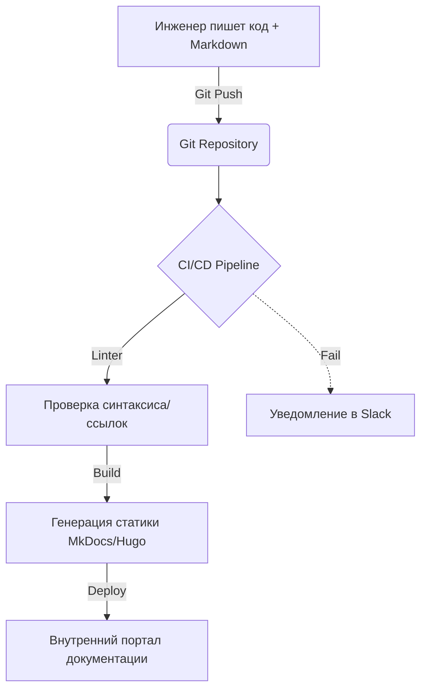

# Documentation as Code (DaC)

## 📖 История из жизни: Боль и Решение
**Боль:** Команда DevOps разрослась, и инфраструктурные изменения стали обгонять обновление документации в Confluence. Разработчики использовали устаревшие инструкции по деплою, что приводило к сбоям на проде.
**Решение:** Внедрение Documentation as Code (DaC). Документация переехала в Git, пишется в Markdown рядом с кодом и деплоится через CI/CD (например, MkDocs + GitLab Pages). Нет PR без обновленной документации!

## 📊 Архитектура процесса (Mermaid)


## 💻 Примеры

### MkDocs Конфигурация (mkdocs.yml)
```yaml
site_name: DevOps Docs
nav:
  - Home: index.md
  - Infrastructure: infra.md
  - Playbooks: playbooks.md
theme:
  name: material
  palette:
    scheme: slate
```

### CI/CD Pipeline (GitLab CI)
```yaml
pages:
  stage: deploy
  image: squidfunk/mkdocs-material
  script:
    - mkdocs build --site-dir public
  artifacts:
    paths:
      - public
  only:
    - main
```

## 🛠️ Day 2 Operations (Советы)
1. **Linter везде:** Используйте `markdownlint` или `vale` в CI для поддержания единого стиля и поиска битых ссылок (например, `lychee`).
2. **Шаблонизация:** Создайте шаблоны для инцидентов (post-mortem), архитектурных решений (ADR) и runbooks.
3. **Версионирование:** Привязывайте версию документации к тегам релизов API/инфраструктуры.

## ⚠️ Антипаттерны
- **Изолированные репозитории:** Хранить документацию в отдельном от кода репозитории (вероятность рассинхронизации возрастает).
- **Слишком сложный пайплайн:** Если документация собирается 10 минут, её перестанут писать.
- **Дублирование инфы:** Копирование кусков кода в текст вместо автоматической генерации (используйте Swagger/OpenAPI или автогенерацию из Terraform).
