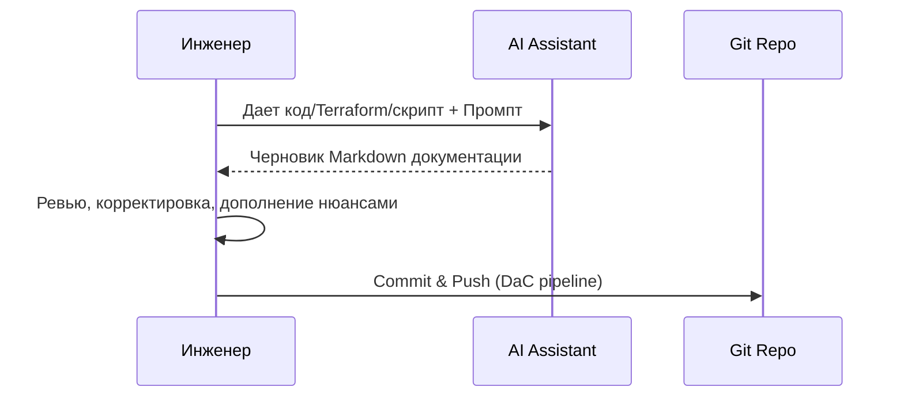

# AI для написания документации

## 📖 История из жизни: Боль и Решение
**Боль:** После успешной миграции в Kubernetes нужно было написать десятки runbooks и описаний сервисов. Инженеры саботировали задачу, ссылаясь на "более важные таски", и on-call дежурным приходилось продираться сквозь код.
**Решение:** Внедрение AI-ассистентов (GitHub Copilot, ChatGPT, специализированные LLM) в процесс написания документации. Инженер кидает скрипт в промпт, а AI генерирует черновик runbook'а, который остается только отревьюить.

## 📊 Процесс использования AI (Mermaid)


## 💻 Примеры

### Промпт для генерации Runbook
```text
Ты DevOps инженер. Проанализируй этот bash-скрипт очистки логов и напиши Runbook в формате Markdown.
Структура: 
1. Описание 
2. Пререквизиты 
3. Пошаговая инструкция 
4. Возможные ошибки и способы решения.
```

### Пример сгенерированного Bash-сниппета для автоматизации
```bash
# Использование CLI утилиты (например, gh copilot) для генерации описания коммита/PR
git diff | gh copilot suggest -t "Generate PR description for these infrastructure changes" > PR_DESC.md
```

## 🛠️ Day 2 Operations (Советы)
1. **Кастомные GPT/Агенты:** Создайте внутреннего AI-агента, обученного на вашей существующей базе знаний и гайдлайнах, чтобы он генерировал доки в нужном tone of voice.
2. **Валидация фактов:** Всегда проверяйте сгенерированные AI команды (особенно деструктивные, вроде `rm`, `drop`).
3. **Интеграция в IDE:** Используйте плагины, которые могут генерировать docstrings прямо в редакторе по нажатию шортката.

## ⚠️ Антипаттерны
- **Слепое копирование (Copy-Paste):** Вставлять сгенерированную документацию без ревью. AI может галлюцинировать и придумать несуществующие флаги для утилит.
- **Утечка секретов:** Отправка в публичные LLM скриптов, содержащих API-ключи, пароли или чувствительные бизнес-данные.
- **Ожидание магии:** Надежда, что AI напишет высокоуровневую архитектуру без подробного контекста. AI хорош для черновиков, а не для принятия архитектурных решений.
