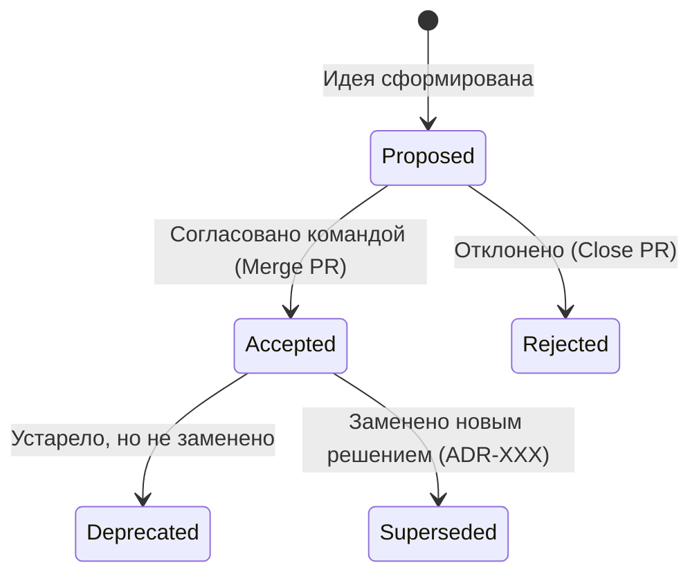

# Architecture Decision Records (ADR)

## DevOps-история
**Боль:** Важные архитектурные решения принимаются в чатах, на созвонах или в кулуарах. Через полгода-год никто в команде (включая тех, кто принимал решение) не может вспомнить, "почему мы выбрали MongoDB, а не PostgreSQL" или "зачем мы добавили Kafka".
**Решение:** ADR (Architecture Decision Records). Короткие, стандартизированные текстовые файлы в формате Markdown, которые фиксируют контекст, само архитектурное решение и его последствия (trade-offs). Хранятся в Git рядом с кодом.

## Жизненный цикл ADR


## Примеры

**Пример структуры ADR (на базе MADR)**
```markdown
# ADR 001: Выбор базы данных для системы профилей

## Статус
Accepted

## Контекст и проблема
Нам необходимо хранить профили пользователей. Набор полей профиля будет часто меняться, жесткая схема не подходит.

## Рассмотренные варианты
* PostgreSQL (с использованием JSONB)
* MongoDB
* Cassandra

## Решение
Мы выбираем **MongoDB**. 
Обоснование: нативная работа с документами без схемы, готовая экспертиза в команде, не требуются сложные транзакции между профилями.

## Последствия
* **Положительные:** Быстрая итерация схемы, простое горизонтальное масштабирование.
* **Отрицательные:** Отсутствие JOIN-ов, что потребует денормализации данных; риск нарушения консистентности при сложных обновлениях.
```

**Использование утилиты adr-tools**
```bash
# Установка (macOS)
brew install adr-tools

# Инициализация директории для ADR
adr init doc/architecture/decisions

# Создание нового ADR
adr new "Выбор базы данных для профилей"

# Генерация оглавления (лог всех решений)
adr generate toc > doc/architecture/decisions/README.md
```

## Day 2 operations
* **Ревью через PR:** Новые ADR должны проходить ревью командой (и архитектором) через стандартный процесс Pull/Merge Request.
* **Трассируемость:** Указывайте в ADR ссылки на задачи в Jira, инциденты или Confluence, чтобы связать решение с бизнес-контекстом.
* **Пересмотр:** Регулярно актуализируйте статусы (например, перевод в `Superseded` при внедрении новой технологии).

## Антипаттерны
* **Излишняя детализация:** Превращение ADR в 20-страничный HLD (High-Level Design). ADR должен быть коротким (1-2 страницы) и фокусироваться на *решении* и *причинах*.
* **Игнорирование последствий:** Описание только плюсов выбранного решения. Честный анализ негативных последствий (trade-offs) критически важен.
* **ADR задним числом:** Написание ADR через год после внедрения технологии. Теряется оригинальный контекст и альтернативы, которые реально рассматривались.
