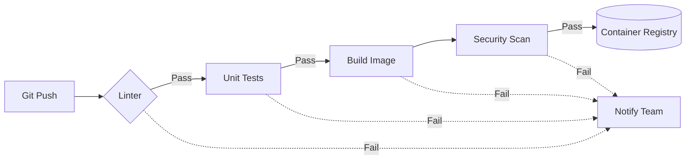

# Шаблон: CI Pipeline

## История из жизни (Боль и Решение)
**Боль:** Разработчики собирали Docker-образы на своих ноутбуках и пушили их напрямую в registry. Из-за разницы в окружениях "работало на локалке, но падало в проде", а тесты запускались от случая к случаю. Релизы занимали часы.
**Решение:** Внедрение CI/CD Pipeline. Сборка, тестирование и линтинг перенесены в изолированные раннеры (GitLab CI / GitHub Actions). Процесс стал детерминированным, быстрым и прозрачным для всей команды.

## Архитектура (Mermaid)


## Примеры (GitLab CI / YAML)

**Базовый `.gitlab-ci.yml`:**
```yaml
stages:
  - test
  - build
  - scan

variables:
  DOCKER_IMAGE: $CI_REGISTRY_IMAGE:$CI_COMMIT_SHORT_SHA

lint_and_test:
  stage: test
  image: golang:1.20
  script:
    - golangci-lint run ./...
    - go test -v -race -coverprofile=coverage.txt ./...
  coverage: '/coverage: \d+\.\d+% of statements/'

build_image:
  stage: build
  image: docker:24.0
  services:
    - docker:24.0-dind
  script:
    - docker login -u $CI_REGISTRY_USER -p $CI_REGISTRY_PASSWORD $CI_REGISTRY
    - docker build -t $DOCKER_IMAGE .
    - docker push $DOCKER_IMAGE

container_scan:
  stage: scan
  image: aquasec/trivy:latest
  script:
    - trivy image --exit-code 1 --severity CRITICAL,HIGH $DOCKER_IMAGE
  allow_failure: true
```

## Day 2 Operations (Эксплуатация)
- **Кеширование:** Настройте кэширование зависимостей (например, `.npm/`, `.m2/`, `go/pkg/mod`), чтобы ускорить время сборки.
- **Очистка Registry:** Настройте политики жизненного цикла (Retention policies) для Container Registry, чтобы старые образы от Merge Requests не съели всё место на диске.
- **Динамические окружения (Review Apps):** Разворачивайте эфемерные окружения для каждого Merge Request, чтобы тестировщики могли проверять фичи до влития в `main`.
- **Метрики пайплайна:** Отслеживайте время выполнения джобов (DORA metrics), чтобы вовремя замечать деградацию пайплайна.

## Антипаттерны
- **Монструозные скрипты:** Написание сложных логических Bash-скриптов прямо внутри секции `script` в YAML. Лучше вынести логику в отдельные `.sh` файлы или Makefile.
- **Использование latest/master тэгов для базовых образов:** Запуск CI-джобов в контейнерах с нестабильными версиями (например, `image: node:latest`), что может сломать сборку в любой момент.
- **Секреты в коде пайплайна:** Использование токенов или паролей в открытом виде. Секреты должны передаваться только через защищенные переменные (Masked/Protected variables) или Vault.
- **Сборка ради сборки:** Выполнение тяжеловесных сборок (Build Image) на каждый коммит. Лучше фильтровать их по веткам или изменениям в определенных путях.
