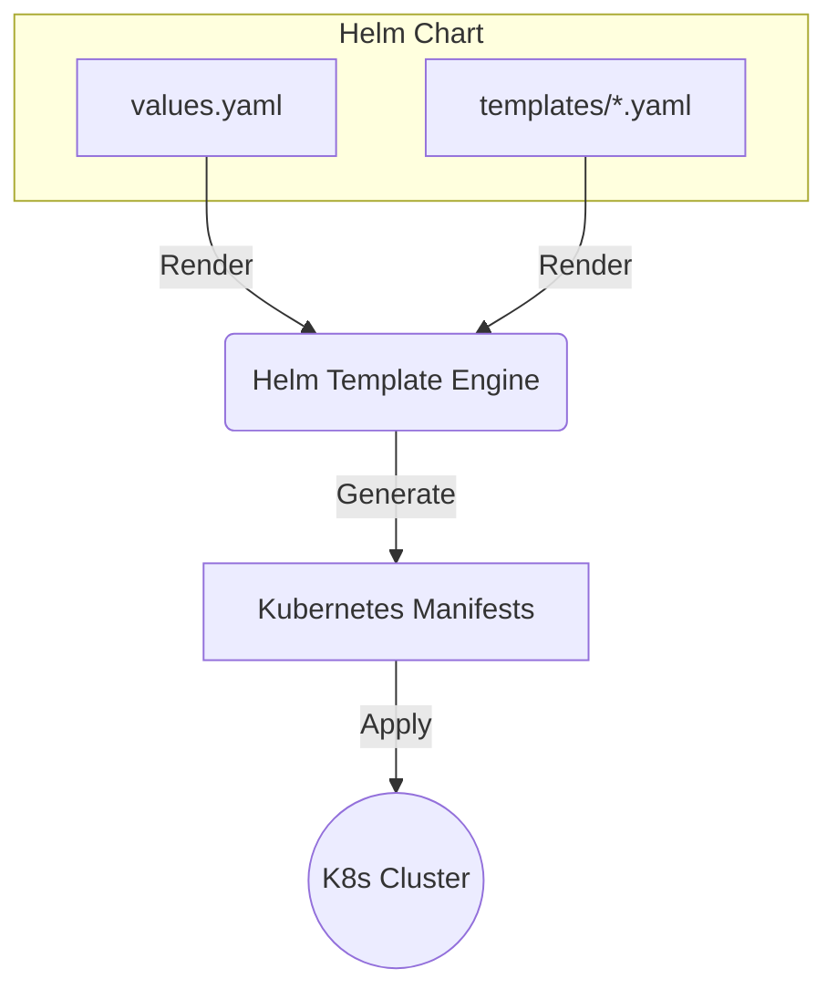

# Шаблон: Helm Chart

## История из жизни (Боль и Решение)
**Боль:** Каждая команда деплоила микросервисы своими "кастомными" bash-скриптами и манифестами. При изменении порта или добавлении Ingress приходилось править десятки репозиториев, ловя синтаксические ошибки в YAML.
**Решение:** Внедрение Helm-чартов. Создан единый базовый чарт (Umbrella/Library chart), который инкапсулирует логику развертывания. Теперь разработчики только переопределяют `values.yaml`, а инфраструктура стандартизирована.

## Архитектура (Mermaid)


## Примеры (YAML/Bash)

**Базовая структура (`Chart.yaml`):**
```yaml
apiVersion: v2
name: my-microservice
description: A Helm chart for standard microservice
type: application
version: 1.0.0
appVersion: "1.16.0"
```

**Шаблон Deployment (`templates/deployment.yaml`):**
```yaml
apiVersion: apps/v1
kind: Deployment
metadata:
  name: {{ include "my-microservice.fullname" . }}
  labels:
    {{- include "my-microservice.labels" . | nindent 4 }}
spec:
  replicas: {{ .Values.replicaCount }}
  selector:
    matchLabels:
      {{- include "my-microservice.selectorLabels" . | nindent 6 }}
  template:
    metadata:
      labels:
        {{- include "my-microservice.selectorLabels" . | nindent 8 }}
    spec:
      containers:
        - name: {{ .Chart.Name }}
          image: "{{ .Values.image.repository }}:{{ .Values.image.tag | default .Chart.AppVersion }}"
          ports:
            - name: http
              containerPort: {{ .Values.service.port }}
              protocol: TCP
          resources:
            {{- toYaml .Values.resources | nindent 12 }}
```

**Команды (Bash):**
```bash
# Проверка рендеринга (Dry Run)
helm template my-release ./my-microservice -f values-prod.yaml --debug

# Установка/Обновление
helm upgrade --install my-release ./my-microservice --namespace prod --create-namespace
```

## Day 2 Operations (Эксплуатация)
- **Управление секретами:** Не храните секреты в `values.yaml` в открытом виде. Используйте Helm Secrets, SOPS или External Secrets Operator.
- **Откат релизов:** В случае проблем используйте `helm rollback <release-name> <revision>`. Helm хранит историю релизов в секретах K8s.
- **Тестирование чарта:** Используйте `helm test`, добавив pod'ы с тестами (аннотация `"helm.sh/hook": test`), чтобы проверять работоспособность после деплоя.
- **Линтинг:** Интегрируйте `helm lint` и `kubeval` / `datree` в CI-пайплайн для проверки манифестов перед деплоем.

## Антипаттерны
- **Всё в одном чарте:** Создание огромного монолитного чарта для всех компонентов системы. Лучше использовать subcharts или зависимости (`requirements.yaml`).
- **Hardcode в шаблонах:** Жесткое кодирование значений (например, имен доменов или ресурсов) прямо в `templates/*.yaml` вместо выноса в `values.yaml`.
- **Игнорирование хуков:** Попытки реализовать миграции БД через обычные Job'ы, когда стоит использовать Helm Hooks (например, `pre-install`, `pre-upgrade`).
- **Использование `latest` тега:** Никогда не используйте `image: tag: latest`. Это ломает идемпотентность и откат.
