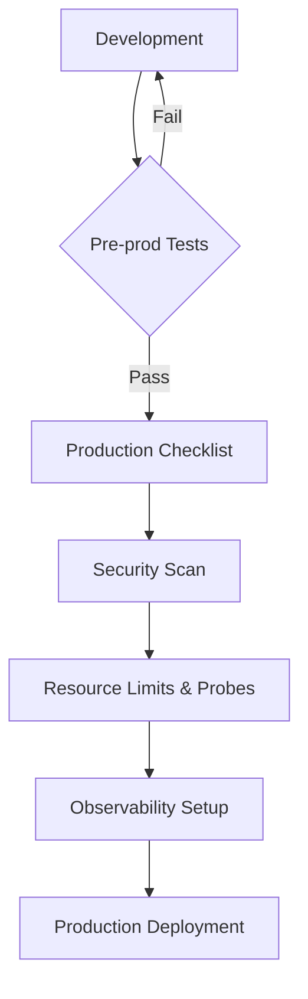

# Production Checklist

## 📖 История: Боль и Решение
**Боль:** Команда выкатила новый сервис в production в пятницу вечером. Забыли настроить resource limits и readiness probes. Утром сервис упал по OOM (Out Of Memory), потянув за собой соседей по ноде, а балансировщик продолжал слать трафик на мертвые поды.
**Решение:** Строгий Production Checklist, который проходит каждый сервис перед деплоем, автоматизированный через CI/CD пайплайны.

## 🔄 Процесс выкатки в Production



## 📋 Основной Чек-лист (Примеры)

### 1. Resource Limits & Requests (Kubernetes)
Никогда не деплойте без лимитов.

```yaml
apiVersion: v1
kind: Pod
metadata:
  name: my-app
spec:
  containers:
  - name: app-container
    image: my-registry/app:1.0.0
    resources:
      requests:
        memory: "256Mi"
        cpu: "100m"
      limits:
        memory: "512Mi"
        cpu: "250m"
```

### 2. Liveness & Readiness Probes
Гарантируйте, что трафик идет только на готовые поды.

```yaml
    livenessProbe:
      httpGet:
        path: /healthz
        port: 8080
      initialDelaySeconds: 15
      periodSeconds: 20
    readinessProbe:
      httpGet:
        path: /ready
        port: 8080
      initialDelaySeconds: 5
      periodSeconds: 10
```

## 🛠 Day 2 Operations (Советы)
*   **Регулярный пересмотр лимитов:** Используйте инструменты вроде VPA (Vertical Pod Autoscaler) для анализа реального потребления.
*   **Тестирование алертов:** Раз в квартал проводите GameDays, ломая сервисы на pre-prod, чтобы проверить срабатывание алертов.
*   **Ротация секретов:** Убедитесь, что процесс смены паролей к БД не требует даунтайма.

## 🚫 Антипаттерны
*   **"Временно" ручные изменения:** `kubectl edit deployment` в production — верный путь к рассинхронизации конфигурации. Используйте только GitOps.
*   **Чрезмерное алертирование:** Настройка алертов на каждый warning в логах приводит к alert fatigue. Алерты должны требовать действия.
*   **Игнорирование gracefully shutdown:** Отсутствие обработки SIGTERM приводит к обрыву соединений у пользователей во время деплоя.
