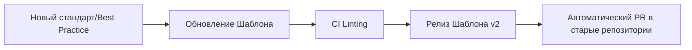

# Шаблоны Документации DevOps

## 📖 История: Боль и Решение
**Боль:** Каждый инженер заводил репозиторий со своей структурой README. Кто-то писал только как запустить локально, кто-то вообще ничего не писал. При онбординге нового сотрудника или передаче дежурства тратились часы на то, чтобы понять базовые вещи: где логи, как деплоить и кто оунер.
**Решение:** Единый репозиторий шаблонов. Любой новый сервис или инфраструктурный компонент начинается с копирования стандартизированного шаблона.

## 🔄 Жизненный цикл шаблонов



## 💻 Примеры использования

### Скрипт инициализации нового сервиса
Простой bash-скрипт для применения базового шаблона:

```bash
#!/bin/bash
# init-project.sh
PROJECT_NAME=$1
TEMPLATE_DIR="/opt/templates/microservice"

if [ -z "$PROJECT_NAME" ]; then
  echo "Usage: ./init-project.sh <project_name>"
  exit 1
fi

mkdir -p "./$PROJECT_NAME"
cp -r $TEMPLATE_DIR/* "./$PROJECT_NAME/"
sed -i "s/{{PROJECT_NAME}}/$PROJECT_NAME/g" "./$PROJECT_NAME/README.md"

echo "Project $PROJECT_NAME initialized successfully with standard templates."
```

### Структура типичного README
```markdown
# {{PROJECT_NAME}}
- Описание
- Архитектура (ссылка или схема)
- Зависимости (БД, кэш)
- Как запустить локально
- Ссылки на дашборды и логи
```

## 🛠 Day 2 Operations (Советы)
*   **Версионирование шаблонов:** Не меняйте шаблоны in-place. Выпускайте версии (v1, v2), чтобы старые проекты не ломались при проверке линтерами.
*   **Автоматизация проверок:** Настройте CI-пайплайн (например, с помощью `markdown-link-check` или кастомных правил), который проверяет, что в README заполнены обязательные поля.
*   **Сбор обратной связи:** Раз в полгода спрашивайте у команды разработчиков, не слишком ли шаблоны перегружены бюрократией.

## 🚫 Антипаттерны
*   **Шаблон ради шаблона:** Создание 10-страничного шаблона для микросервиса из 100 строк кода. Сохраняйте баланс.
*   **Мертвые шаблоны:** Написание шаблона один раз и забвение. Инструменты и процессы меняются, шаблоны должны эволюционировать вместе с ними.
*   **Дублирование кода/конфига в документации:** Не копируйте огромные куски YAML в README, если они могут устареть. Лучше дайте ссылку на исходный файл в репозитории.
