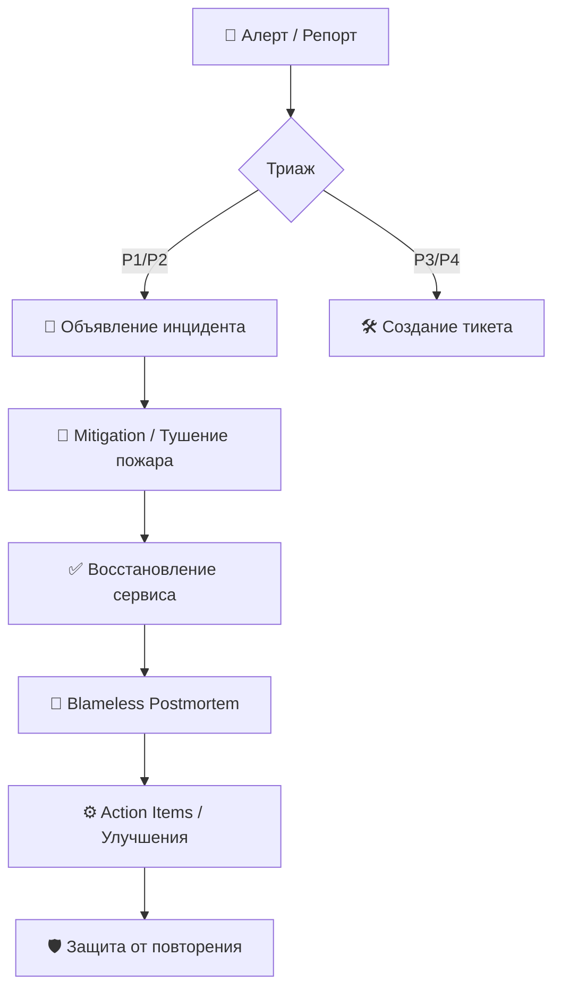

# 🚨 Incident, Runbook & Postmortem

## 📖 DevOps Story
**Боль:** 3 часа ночи. Прод лежит. В чатах паника, дежурный судорожно ищет, как откатить последний деплой, попутно пингуя разработчиков, которые спят. Никто не знает актуальную архитектуру, а логи размазаны по десятку систем.
**Решение:** Стандартизированный процесс обработки инцидентов (Incident Response), краткие и актуальные ранбуки (Runbooks) и культура Blameless Postmortems (разбор полетов без поиска виноватых). Ошибки — это повод улучшить систему, а не наказать инженера.

## 🔄 Жизненный цикл инцидента


## 📋 Пример: Шаблон Postmortem (Markdown/YAML)
```yaml
incident_name: "Отказ платежного шлюза"
date: "2026-07-25"
status: "resolved"
severity: "P1"
impact: "Пользователи не могли оплатить заказы в течение 45 минут"
root_cause: "Истек SSL сертификат внутреннего балансировщика, так как крон-джоба обновления упала из-за нехватки памяти"
timeline:
  - "03:00 - Сработал алерт 5xx на /checkout"
  - "03:15 - Дежурный начал расследование"
  - "03:40 - Обнаружен просроченный сертификат"
  - "03:45 - Сертификат обновлен вручную, сервис восстановлен"
action_items:
  - task: "Настроить автообновление через cert-manager"
    owner: "@devops-team"
    jira_ticket: "DEV-1024"
  - task: "Добавить алерт на срок жизни сертификата < 14 дней"
    owner: "@monitoring-team"
    jira_ticket: "DEV-1025"
```

## 🌅 Day 2 Operations (Эксплуатация)
- **Game Days (Chaos Engineering):** Регулярно ломайте систему на стейджинге (или в проде, если хватает смелости и резервов!), чтобы проверять актуальность ранбуков и тренировать дежурных.
- **Onboarding:** Давайте новичкам читать старые постмортемы. Это лучший способ понять, как реально работает система и где ее слабые места.
- **Трекинг метрик:** Отслеживайте MTTD (Mean Time To Detect) и MTTR (Mean Time To Recovery). Улучшения инфраструктуры должны вести к снижению этих показателей.

## ❌ Антипаттерны
- **"Охота на ведьм" (Blame Culture):** Поиск и наказание виноватого (Human Error). Люди ошибаются всегда, виновата система, позволившая ошибке дойти до продакшена без проверок.
- **Мертвые Action Items:** Написать идеальный постмортем и забить на задачи по улучшению (тикеты висят в бэклоге годами, пока инцидент не повторится).
- **Runbook-Война и Мир:** Писать 100-страничные мануалы, которые никто не сможет прочитать во время паники. Ранбук должен быть как инструкция к огнетушителю: коротко, понятно, по шагам.
