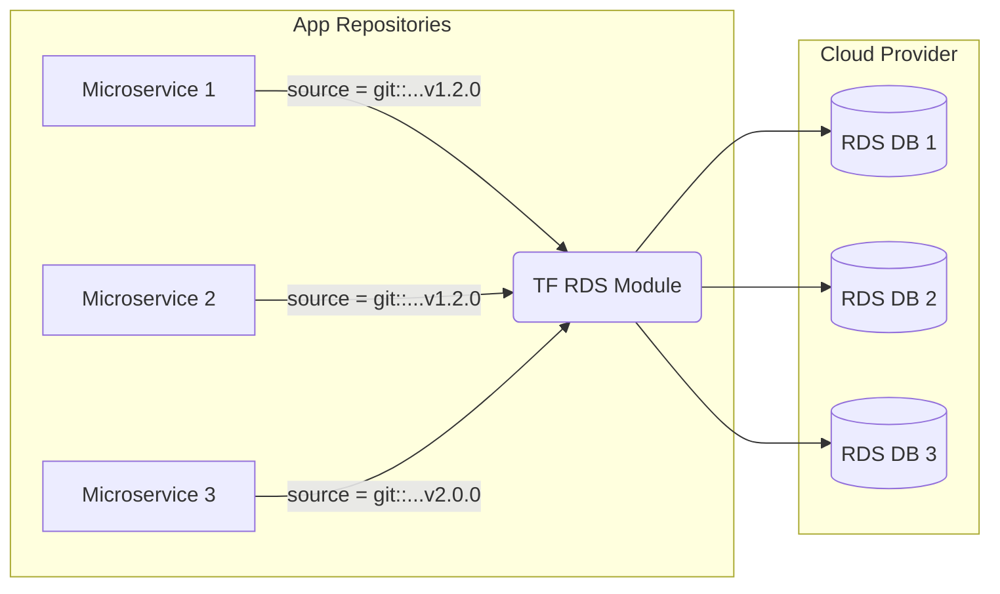

# 🏗 Terraform Module

## 📖 DevOps Story
**Боль:** 50 микросервисов, и каждый раз разработчики или админы копипастят код для создания RDS базы данных. Когда служба безопасности требует включить шифрование Storage во всех базах, вам приходится делать 50 пулл-реквестов. Инфраструктура разъезжается, конфигурационный дрифт неизбежен.
**Решение:** Использование переиспользуемых, версионируемых модулей Terraform. Это единая точка правды (Single Source of Truth), где security и корпоративные best practices (тегирование, бэкапы) зашиты по умолчанию (Secure by default).

## 🔄 Архитектура использования модуля


## 📋 Пример: Структура и вызов модуля

**Структура идеального модуля:**
```bash
terraform-aws-rds-module/
├── main.tf        # Основная логика создания ресурсов
├── variables.tf   # Входные параметры (с type, description, validation)
├── outputs.tf     # Что модуль возвращает (ARNs, endpoints)
├── versions.tf    # Требования к версии Terraform и провайдеров
└── README.md      # Автогенерируемая документация (через terraform-docs)
```

**Пример вызова (потребления) модуля:**
```hcl
module "app_database" {
  # ВСЕГДА используем фиксацию версии (тегом)
  source = "git::https://github.com/company/terraform-aws-rds-module.git?ref=v2.1.0"
  
  environment    = "prod"
  db_name        = "orders_db"
  instance_class = "db.t4g.large"
  
  # Шифрование, multi-az и бекапы включены внутри модуля по умолчанию!
}
```

## 🌅 Day 2 Operations (Эксплуатация)
- **Семантическое версионирование (SemVer):** Выпускайте модули строго по тегам (например, `v1.0.0`). Ломающие изменения (breaking changes) выкатывайте только в мажорных версиях.
- **Тестирование инфраструктуры:** Используйте `Terratest` для написания интеграционных тестов на Go, или `Checkov`/`TFLint`/`Trivy` в CI пайплайнах модуля для статического анализа безопасности.
- **Автодокументация:** Используйте `terraform-docs` (в связке с pre-commit hooks) для автоматической генерации README.md на основе ваших variables и outputs. Никто не любит писать доку руками.

## ❌ Антипаттерны
- **"Модуль-Бог" (God Module):** Создание одного монолитного модуля `terraform-aws-infrastructure`, который разворачивает сразу VPC, EKS, RDS и Redis. Разбивайте на логические компоненты!
- **Отсутствие пиннинга версий:** Использование ветки `main` (отсутствие `?ref=` в source). Любой коммит в мастер модуля может мгновенно сломать прод у всех потребителей.
- **Хардкод параметров:** Жесткое прописывание Account ID, регионов, AMI или имен ресурсов внутри модуля. Всё, что может измениться, должно прокидываться через `variables.tf`.
