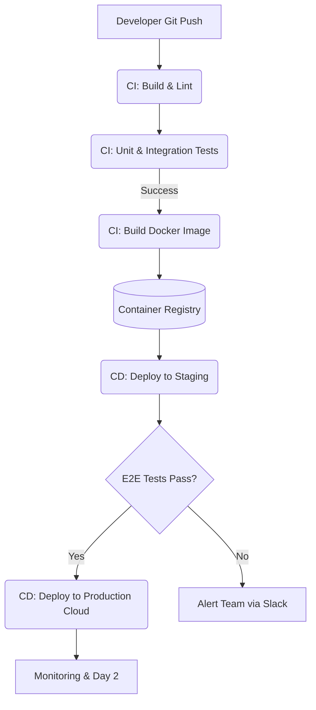

# CI/CD и Cloud: Непрерывная поставка в облаке

## DevOps История (Боль и Решение)

**Боль:** Команда разработчиков релизила новые фичи раз в месяц. Процесс сборки происходил локально на ноутбуке лид-разработчика, тестирование проводилось руками. При деплое часто ломался production, так как окружения (Dev/Stage/Prod) кардинально отличались, а простой (downtime) при обновлениях составлял часами.

**Решение:** Внедрение CI/CD пайплайнов (например, GitLab CI / GitHub Actions) и миграция инфраструктуры в Cloud (Kubernetes/ECS). Сборка, запуск тестов и проверка линтерами стали автоматическими при каждом коммите. Деплой перешел на стратегию Blue/Green или Canary, что позволило релизить по 10 раз в день без даунтайма.

## Архитектура CI/CD Pipeline (Mermaid)



## Примеры кода

### GitLab CI (gitlab-ci.yml)
```yaml
stages:
  - build
  - test
  - deploy

build_image:
  stage: build
  script:
    - docker build -t my-app:$CI_COMMIT_SHA .
    - docker push my-registry.com/my-app:$CI_COMMIT_SHA

run_tests:
  stage: test
  script:
    - npm ci
    - npm run test

deploy_k8s:
  stage: deploy
  script:
    - kubectl set image deployment/my-app my-app=my-registry.com/my-app:$CI_COMMIT_SHA
  only:
    - main
```

### Bash скрипт для локальной проверки (git pre-commit hook)
```bash
#!/bin/bash
# Запуск линтера и тестов локально перед коммитом
echo "Running linters..."
npm run lint || { echo "Linting failed! Fix errors before commit."; exit 1; }

echo "Running unit tests..."
npm run test || { echo "Tests failed!"; exit 1; }

echo "All checks passed. Proceeding with commit..."
```

## Day 2 Operations (Жизнь после релиза)

1. **Observability (Мониторинг и Логирование):** После автоматического деплоя критически важно иметь метрики (Prometheus/Grafana) и централизованные логи (ELK/Loki). Пайплайн должен уметь делать авто-откат (rollback) на основе метрик (например, рост 500-х HTTP ошибок после релиза).
2. **Управление секретами:** Интеграция пайплайнов с Vault или облачными Secret Manager'ами (AWS Secrets Manager). Никаких секретов в переменных CI-системы, если они могут быть случайно распечатаны в логах.
3. **Оптимизация времени пайплайна:** Используйте кэширование зависимостей (Docker Layer Caching, NPM cache) и параллельное выполнение независимых тестов, чтобы сборка занимала минуты, а не часы.
4. **GitOps:** Использование инструментов вроде ArgoCD или FluxCD, где желаемое состояние кластера в облаке автоматически синхронизируется с манифестами в Git-репозитории.

## Антипаттерны

- **"Снежинки" на CI агентах:** Установка системных зависимостей на Runner'ах руками. *Решение:* Запускать все CI-джобы в эфемерных, изолированных Docker-контейнерах.
- **Один пайплайн для всех окружений без защиты:** Отсутствие ручных аппрувов или автоматических проверок безопасности (Security Scanning/SAST) перед выкаткой в Production.
- **Долгоиграющие ветки (Long-lived branches):** Отказ от Trunk-based development в пользу долгих feature-веток, что приводит к "аду слияния" (merge hell) и ломает саму идею Continuous Integration.
- **Креденшиалы в коде:** Хранение токенов доступа к облаку или паролей БД прямо в скриптах деплоя.
