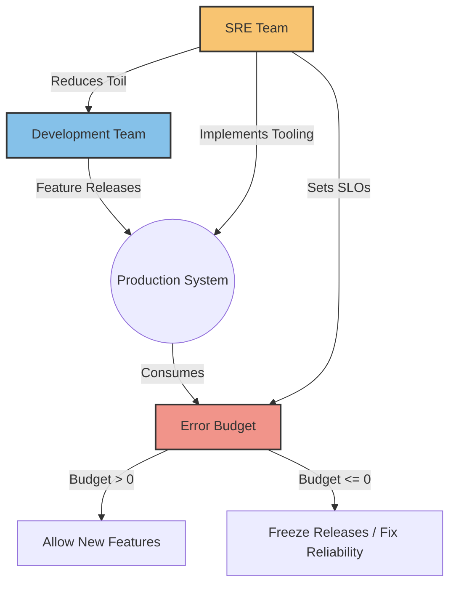

# Собеседования: DevOps vs SRE

## 📖 История: Боль и Решение
**Боль:** Компания нанимает "DevOps-инженеров", сажает их в отдельный отдел. Разработчики перекидывают код через стену DevOps-ам, те пытаются его задеплоить, всё падает. Возникает классический конфликт Dev (хотят быстро внедрять фичи) и Ops (хотят стабильности).
**Решение:** Внедрение практик SRE (Site Reliability Engineering). SRE — это имплементация DevOps-философии инженерными методами. Вводятся Error Budgets: если бюджет ошибок не исчерпан, разработчики могут релизить. Если исчерпан — фокус всей команды смещается на стабильность.

## 📊 Mermaid-схема (Баланс SRE)


## 💻 Примеры (SLI/SLO и Toil)

### YAML (Prometheus SLO Alerting)
```yaml
groups:
- name: SLOs
  rules:
  - alert: HighErrorRate
    expr: |
      sum(rate(http_requests_total{status=~"5.."}[5m])) 
      / 
      sum(rate(http_requests_total[5m])) > 0.05
    for: 2m
    labels:
      severity: critical
    annotations:
      summary: "Error rate is above 5% (SLO violation risk)"
```

### Bash (Простейший скрипт для расчета Toil)
```bash
#!/bin/bash
# Простой скрипт для оценки ручного труда (Toil) на основе логов задач
# SRE должны тратить на Toil не более 50% времени

TOIL_HOURS=$(grep -i "manual intervention" tickets.csv | awk -F',' '{sum+=$5} END {print sum}')
TOTAL_HOURS=$(awk -F',' '{sum+=$5} END {print sum}' tickets.csv)

if [ -z "$TOTAL_HOURS" ] || [ "$TOTAL_HOURS" -eq 0 ]; then
    echo "Нет данных по задачам"
    exit 0
fi

TOIL_PERCENT=$(echo "scale=2; ($TOIL_HOURS / $TOTAL_HOURS) * 100" | bc)
echo "Current Toil: $TOIL_PERCENT%"

if (( $(echo "$TOIL_PERCENT > 50.0" | bc -l) )); then
    echo "Внимание: Toil превышает 50%, требуется автоматизация рутинных задач!"
fi
```

## 🌅 Day 2 Operations
* **Управление инцидентами:** Внедрите практику Blameless Postmortems. Цель не найти виноватого, а улучшить систему, найти root cause и предотвратить повторение сбоя.
* **Борьба с Alert Fatigue:** Регулярно ревьюируйте алерты. Каждый алерт должен быть Actionable (понятно, что делать) и вести к конкретному Playbook/Runbook.
* **Capacity Planning:** SRE должны прогнозировать рост нагрузки на основе исторических данных (SLI) и заранее инициировать масштабирование инфраструктуры.

## 🛑 Антипаттерны
* **Цель - 100% доступность:** Это невозможно и неоправданно дорого. Определите разумный SLO (например, 99.9%), а оставшееся время используйте как бюджет на ошибки для инноваций и релизов.
* **SRE как саппорт 3-й линии:** Если инженеры тратят >50% времени на закрытие тикетов руками (Toil) вместо написания кода для автоматизации инфраструктуры, это не SRE, а классический Ops.
* **Алерты без инструкций:** Срабатывание алерта ночью, при котором дежурный инженер не понимает, куда смотреть и что чинить. Отсутствие автоматического обогащения алертов контекстом.
