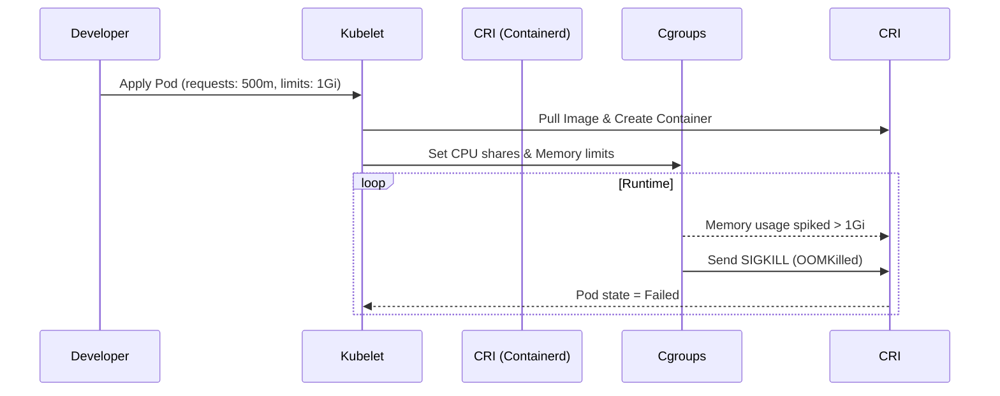

# Интервью: Kubernetes & Docker

## 📖 История из жизни (Боль и Решение)
**Боль:** Node NotReady, поды случайным образом уходят в статус `OOMKilled`. Разработчики просят "просто добавить памяти", но ресурсы узлов кластера исчерпаны. Выясняется, что Java-приложение в контейнере съедает всю память, так как не знает о лимитах cgroups, а базовый образ весит 1.5 ГБ (в нём оставлены исходники, curl, vim и gcc).
**Решение:** Настроили флаги JVM (`-XX:MaxRAMPercentage`), внедрили Multi-stage сборку в Dockerfile, сократив размер образа до 150 МБ (использовали distroless образ). Добавили Resource Quotas на namespace и жестко прописали requests и limits для всех подов через LimitRange.

## 📊 Архитектура / Схема (Жизненный цикл и ресурсы)


## 💻 Примеры (YAML / Dockerfile)
**Multi-stage Dockerfile (Безопасно и легковесно):**
```dockerfile
# Stage 1: Build
FROM golang:1.21 AS builder
WORKDIR /app
COPY . .
RUN CGO_ENABLED=0 GOOS=linux go build -o main .

# Stage 2: Runtime (Distroless)
FROM gcr.io/distroless/static-debian11
COPY --from=builder /app/main /
USER nonroot:nonroot
CMD ["/main"]
```

**K8s Resources (QoS Guaranteed):**
```yaml
resources:
  requests:
    memory: "256Mi"
    cpu: "250m"
  limits:
    memory: "256Mi" # limits == requests -> Guaranteed QoS (под не выселят первым)
    cpu: "500m"     # Лимиты по CPU можно делать больше requests (Burst)
```

## 🛠 Day 2 Operations
- **Rightsizing (Оптимизация ресурсов):** Используйте VPA (Vertical Pod Autoscaler) в режиме Recommender или Goldilocks для сбора статистики о реальном потреблении и корректировки requests/limits.
- **Security Scanning:** Интегрируйте Trivy или Clair в CI пайплайн для обязательной блокировки образов с уязвимостями уровня Critical и High до деплоя в кластер.
- **Garbage Collection:** Настройте параметры Kubelet (`imageMinimumGCAge`, `imageGCHighThresholdPercent`) для автоматической очистки старых неиспользуемых образов на нодах.

## ❌ Антипаттерны
1. **Использование тега `:latest`:** Ведет к непредсказуемым деплоям. Невозможно откатиться на "предыдущий latest", а Kubelet по умолчанию ставит `imagePullPolicy: Always`.
2. **Запуск от root:** Контейнеры не должны бежать под суперпользователем (всегда используйте `USER 1000` в Dockerfile, `runAsNonRoot: true`, `allowPrivilegeEscalation: false` в SecurityContext).
3. **Отсутствие Liveness/Readiness проб:** K8s будет отправлять трафик в мертвый под, или постоянно рестартовать под, который просто долго инициализируется при старте.
4. **Слепое копирование `limits=requests` для CPU:** Часто ведет к излишнему CPU Throttling. Лучше опираться на корректные requests для CPU и оставлять limits открытыми (или сильно больше), если позволяют квоты кластера.
